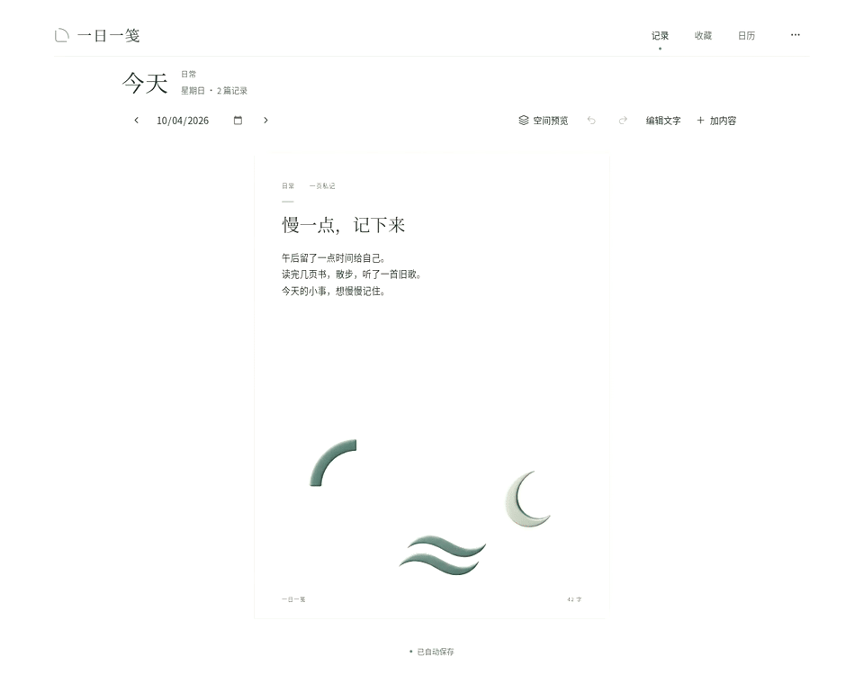
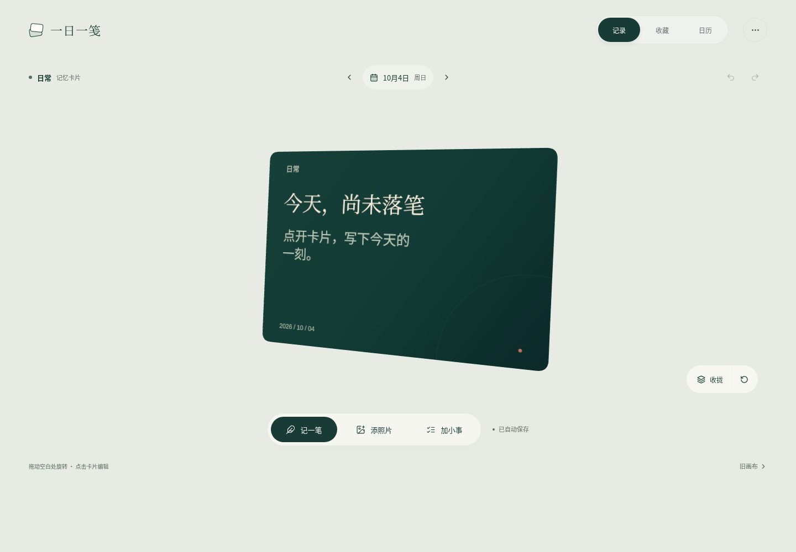
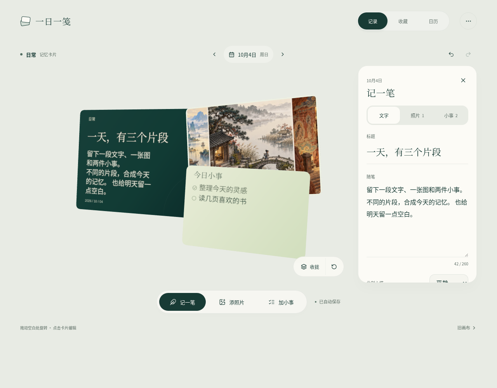
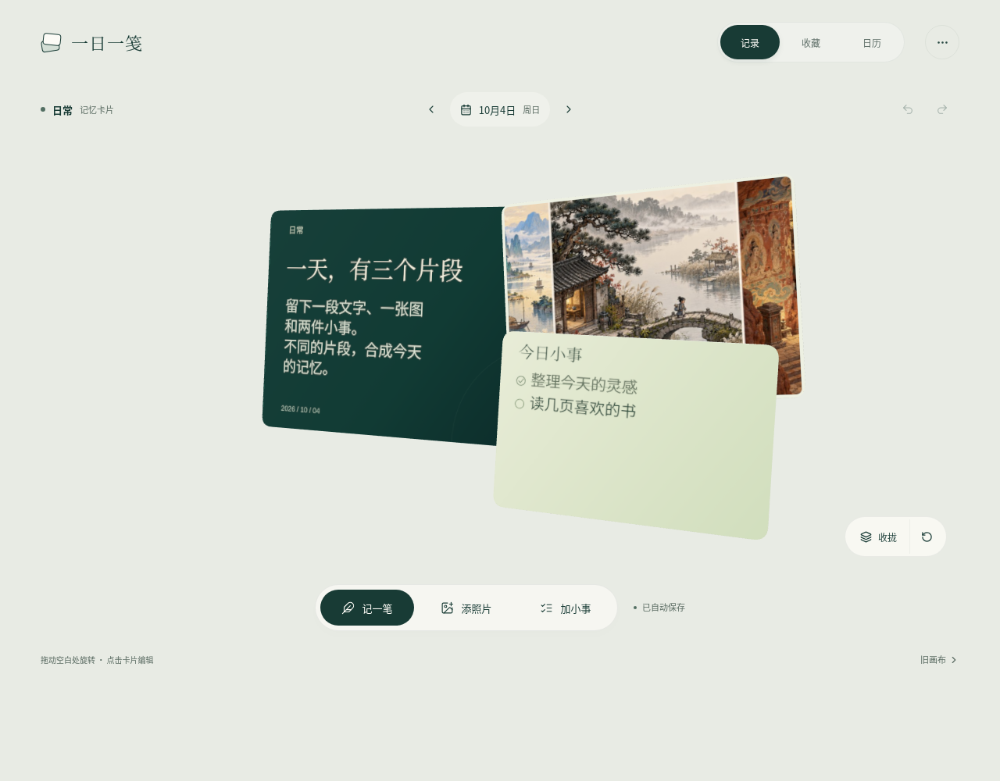
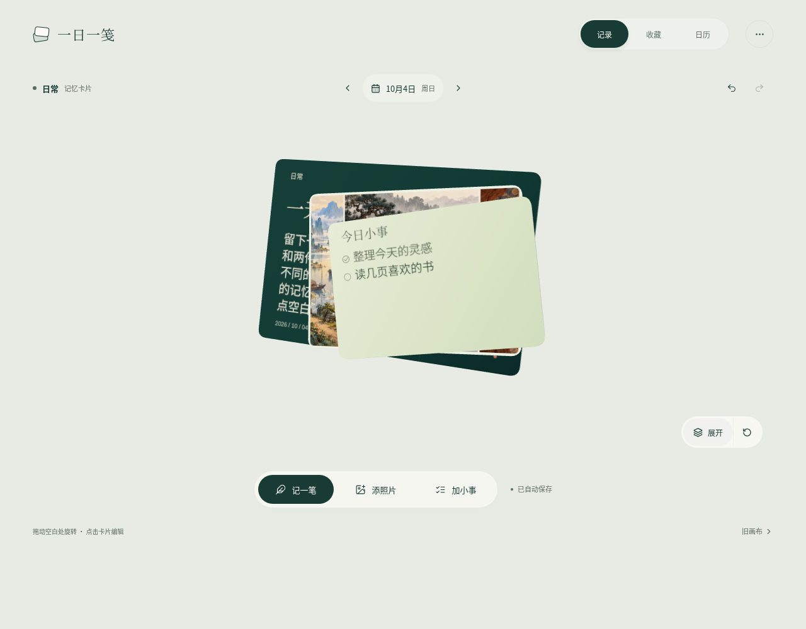
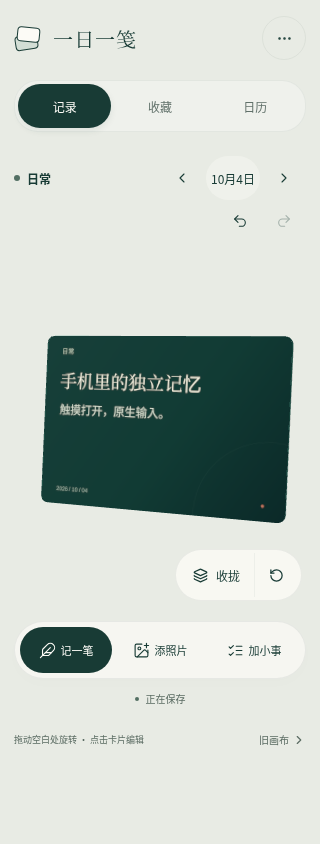

# 一日一笺

**0.7.0** 默认进入三维记忆卡片。文字、真实照片与小事分别形成内容卡，「收拢 / 展开」改变实际卡组构图，点击卡片按需编辑。旧画布继续保留原坐标拼贴和 36 件历史素材。首次打开没有示例日记、照片或假待办。



[查看操作 MP4](preview/journal-digital-demo.mp4) · [查看新版默认页](preview/journal-memory-default.png) · [查看记忆卡组](preview/journal-digital-entry.png)

## 下载与使用

| 文件 | 用法 |
| --- | --- |
| [电子手账 ZIP](https://github.com/liuqihang84-ui/111/raw/refs/heads/journal-playtest/downloads/yiri-journal.zip?v=0.7.0) | 约 6.5 MB，完整解压后打开 `yiri-journal.html` |
| [完整源码 ZIP](https://github.com/liuqihang84-ui/111/raw/refs/heads/journal-playtest/downloads/yiri-journal-source.zip?v=0.7.0) | React / TypeScript / Three.js、原始美术、锁文件、文档与测试 |

「记一笔」编辑当天同一份标题与随笔；「添照片」选择本地 PNG、JPEG 或 WebP；「加小事」新增、完成或删除待办。点击内容卡也可打开相应原生编辑面板。卡组直接展示前后层次，无需另开预览；「收拢 / 展开」改变真实卡片的位置、旋转与遮挡。

场景最多显示最新 6 张照片，编辑面板和 JSON 保留全部媒体。「记录 / 收藏 / 日历」切换记录、手账合集和日期回看，继续支持撤销、重做和自动保存。WebGL 2 不可用时可通过普通内容列表继续记录；减少动态效果偏好保留展合结果。

「旧画布」保留原来的长页编辑、照片与贴纸移动、缩放、旋转、复制、前置、删除和空间预览。温玉 8 件、浮笺旧藏 8 件、印刷旧藏 8 件和旧藏小物 12 件仅在此路径显示。旧本地存储、对象位置、资产 ID 与版本 1 JSON 格式保持兼容。

## 页面与空间











[旧画布](preview/journal-desktop-editor.png) · [旧画布空间预览](preview/journal-desktop-space-preview.png) · [收藏](preview/journal-desktop-books.png) · [月历](preview/journal-desktop-calendar.png) · [实际录制元数据](verification/journal-digital-recording.json)

[UI / VI 规范](journal/docs/VISUAL-IDENTITY.md)、[记忆卡片引擎](journal/docs/MEMORY-ENGINE.md)、[历史美术来源](journal/docs/ART-SOURCES.md) 和 [旧画布引擎](journal/docs/3D-ENGINE.md) 随源码保留。本版没有新增 AI 图片作为默认视觉，卡面来自真实记录；演示来自当前应用实际操作，录制构建 SHA 与交付 HTML 一致。录制中上传的是原有工作台 AI 山水研究板，并非个人摄影，来源与原始文件、归一化图像 SHA 记录于实录元数据。

## 保存与验证

内容自动保存在当前浏览器，照片在本地处理。记忆卡片分享 PNG 为 1440 × 1024，包含文字、最多 6 张最新照片和小事；旧画布 PNG 为 1280 × 1680，保留全部原坐标拼贴。JSON 可恢复全部记录；迁移设备、浏览器、地址、文件路径或清理数据前请导出备份。恢复前自动下载当前备份，无效文件不会覆盖记录。

这是可下载网页，尚未公开托管，没有账号或云端同步。当前托管浏览器限制 `file://`，验收通过真实 HTTP 载入与发布 HTML 相同的字节后断网，保留管理策略；本地双击方式未在该环境实测。

本轮实际浏览器报告记录 **18 项通过，0 失败、0 跳过、0 不稳定**。单元报告记录 31 项通过，0 失败、0 跳过。 完整范围见 [QA.md](journal/docs/QA.md)、[DELIVERY.md](journal/docs/DELIVERY.md)、[浏览器 JSON](verification/journal-browser-report.json) 和 [单元 JSON](verification/journal-unit-report.json)。自动测试不替代视觉体验评价，不推定所有设备的 WebGL 帧率。

```sh
cd journal
bash tools/install.sh
PORT=4180 bash tools/serve.sh preview
```

开发使用 `PORT=4180 bash tools/serve.sh dev`。[启动说明](journal/docs/START.md) 与完整字体、软件许可证随包保留。

此前 [中国美学工作台](https://github.com/liuqihang84-ui/111/tree/art-workbench)、[旧游戏交付](https://github.com/liuqihang84-ui/111/tree/game-playtest) 继续保留。
