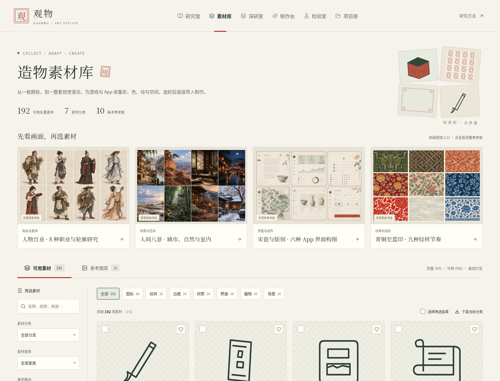
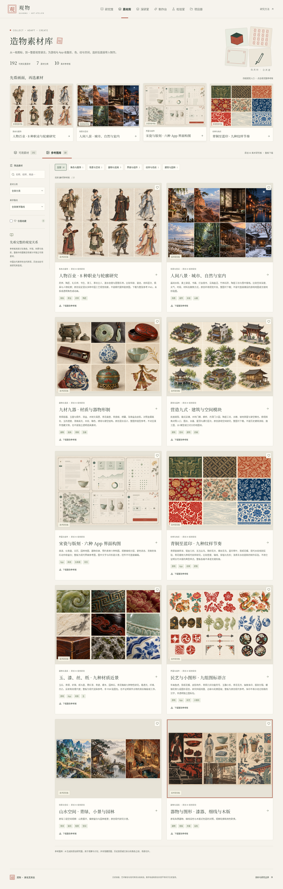
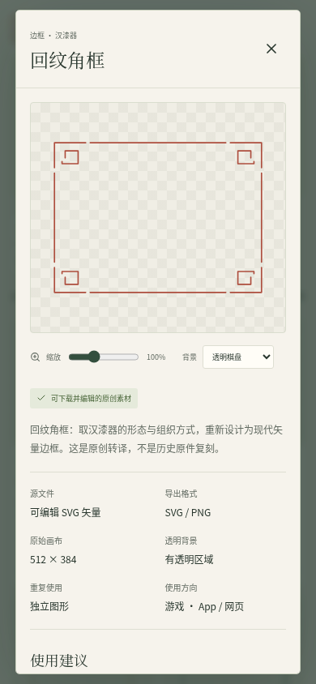
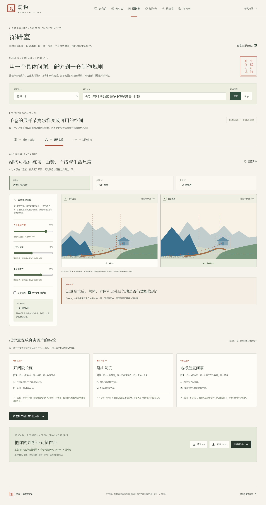

# 观物 · 中国美学与 AI 美术工作台

丰富类型与素材版 **0.3.0**：同时供游戏和 App 创作者研究风格、挑选素材，再带入制作。

**48 类美学路线 · 192 件可用 SVG · 10 张多案例参考板**

覆盖绘画、铜玉、漆器、瓷器、建筑、织绣、书法篆刻、版画、年画、剪纸与皮影。素材含图标、纹样、边框、材质、界面布局、器物和场景；参考图库补充人物、服饰、城市、自然、室内和工艺视觉。

## 下载与打开

| 下载 | 内容 |
| --- | --- |
| [交互网页 ZIP](https://github.com/liuqihang84-ui/111/raw/refs/heads/art-workbench/downloads/guanwu-art-workbench.zip?v=0.3.0) | 完整解压后打开 `guanwu-art-workbench.html`，进入“素材库” |
| [完整素材库 ZIP](https://github.com/liuqihang84-ui/111/raw/refs/heads/art-workbench/downloads/guanwu-material-library.zip?v=0.3.0) | 192 个 SVG、10 张整板 PNG、分类索引和来源说明 |
| [源码 ZIP](https://github.com/liuqihang84-ui/111/raw/refs/heads/art-workbench/downloads/guanwu-art-workbench-source.zip?v=0.3.0) | React/TypeScript 项目、锁文件、图片、字体、启动脚本与测试 |

网页支持类型、风格、用途、透明、平铺、收藏和文字筛选；点击素材可放大、换背景、查看平铺并下载 SVG 或指定尺寸 PNG。可多选下载 ZIP，或把原素材的尺寸和来源送到制作台、保存项目。核心学习与下载无需联网；博物馆来源链接需要联网。

这是可下载网页，当前没有公开在线站点。网页没有连接 AI 模型 API。参考图按整板提供；板中的人物和建筑还需单独制作成透明角色、动画、场景块或运行中的组件。界面 SVG 是可编辑布局图形。

## 实际页面









## 内容与验证

192 件独立 SVG：60 图标、32 纹样、24 边框、24 材质、16 界面、20 器物、16 场景。104 件有透明区域；48 件可平铺。路线共有 73 条资料线索，其中 11 条有具体官方记录核验、62 条待核验；现代数字颜色和原创图像不作为历史复原。详细对照实验保持 12 份，新增路线没有冒用已有深研档案。

本轮 27/27 单元测试与 22/22 浏览器验收通过，手机与断网下载已检查。最终验证结果见 [交付说明](art-workbench/docs/DELIVERY.md) 与 [文件清单](downloads/delivery-manifest.json)。美术资料和素材检查见 [素材目录](art-workbench/docs/material-catalog.md)、[类型索引](art-workbench/docs/rich-taxonomy.md) 和 [内容审校](art-workbench/docs/rich-content-audit.md)。

## 开发

```sh
cd art-workbench
bash tools/install.sh
PORT=4173 bash tools/serve.sh dev
```

生产预览：`PORT=4173 bash tools/serve.sh preview`；重建网页为 `npm run build:portable`，完整素材包为 `npm run build:materials`。

这条独立分支保留已有概念图资料；旧 Godot 游戏在原 `game-playtest` 分支。本轮集中完成美术工作台与素材库。
