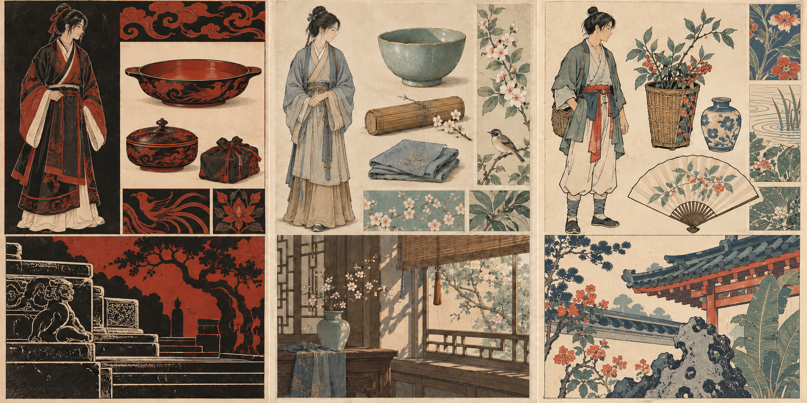

# 中国古代美学：独立美术研究

2026-10-03（Asia/Shanghai）。目前只研究美术，游戏类型以后再定。下列为原创生成辅助的研究稿，没有接入游戏，也不作为历史复原图。

## 第二轮：人物、器物与造型语言

**[打开图片文件页面](https://github.com/liuqihang84-ui/111/blob/concept-art/docs/concepts/chinese_aesthetics_forms_v02.png)** · **[直接打开或下载PNG原图](https://raw.githubusercontent.com/liuqihang84-ui/111/refs/heads/concept-art/docs/concepts/chinese_aesthetics_forms_v02.png)**

从左至右：

1. **朱黑与刻线**：以汉代漆器和画像石为研究线索，比较轮廓、面积和器物曲面。
2. **细线与清润材料**：以宋画、生活器物和陶瓷为线索，比较观察、衣褶、局部设色与材料。
3. **线版与有限套色**：以明末彩色木版画为线索，比较线层、色层和纸面空白。

[第二轮详细研究与待修正部分](docs/aesthetics-form-study-v02.md)。人物服装、纹样和建筑均为试探性原创组合，尚未确定角色或整体方向。

## 第一轮：山水与空间参考

[打开第一轮研究图](docs/concepts/chinese_aesthetics_triptych_v01.png) · [第一轮研究说明](docs/chinese-aesthetics-study.md)

[早期角色与森林参考存档](docs/concepts/preview.md)。早期开发游戏包保留在独立game-playtest分支，本轮没有更新游戏代码或安装包。

如图片没有显示，请点原图链接；也可在图片文件页面选择 **Download raw file / 下载原始文件**。
