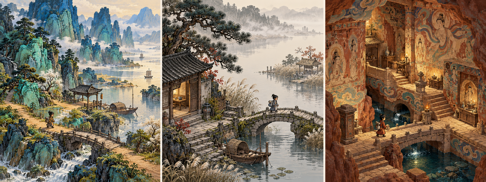

# 中国古代美学：游戏美术研究图

2026-10-03（Asia/Shanghai）。这是新方向的原创生成辅助美术研究，未定稿，尚未接入游戏。

**[点击打开图片文件页面](https://github.com/liuqihang84-ui/111/blob/concept-art/docs/concepts/chinese_aesthetics_triptych_v01.png)** · **[直接打开或下载 PNG 原图](https://raw.githubusercontent.com/liuqihang84-ui/111/refs/heads/concept-art/docs/concepts/chinese_aesthetics_triptych_v01.png)**

从左到右：

1. **青绿山水**：蓝绿山势、赭色岸路，渡口与小聚落嵌在山水之间。
2. **南宋小景**：疏密、偏侧构图、水雾与清幽的生活空间。
3. **敦煌设色**：矿物色、线描、褪色壁画与幻想洞窟。

研究图为2048×768、约3.7MB的PNG。若本页图片没有显示，请点上方原图链接，或在图片文件页面选择 **Download raw file / 下载原始文件**。

[完整美术研究说明](docs/chinese-aesthetics-study.md) · [早期角色与森林参考存档](docs/concepts/preview.md)

本分支保存美术研究图与说明。游戏源码和开发游戏包见独立的 [game-playtest 分支](https://github.com/liuqihang84-ui/111/tree/game-playtest)。
