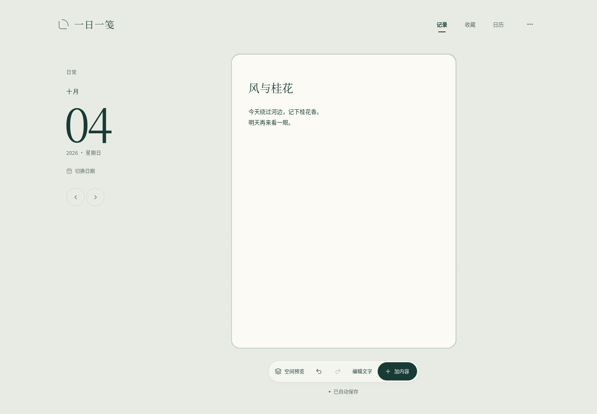
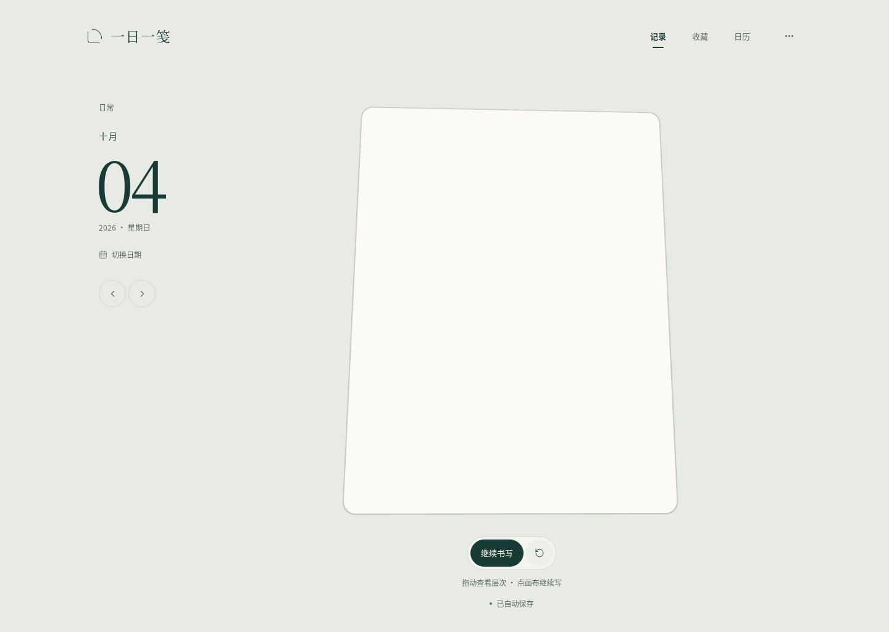
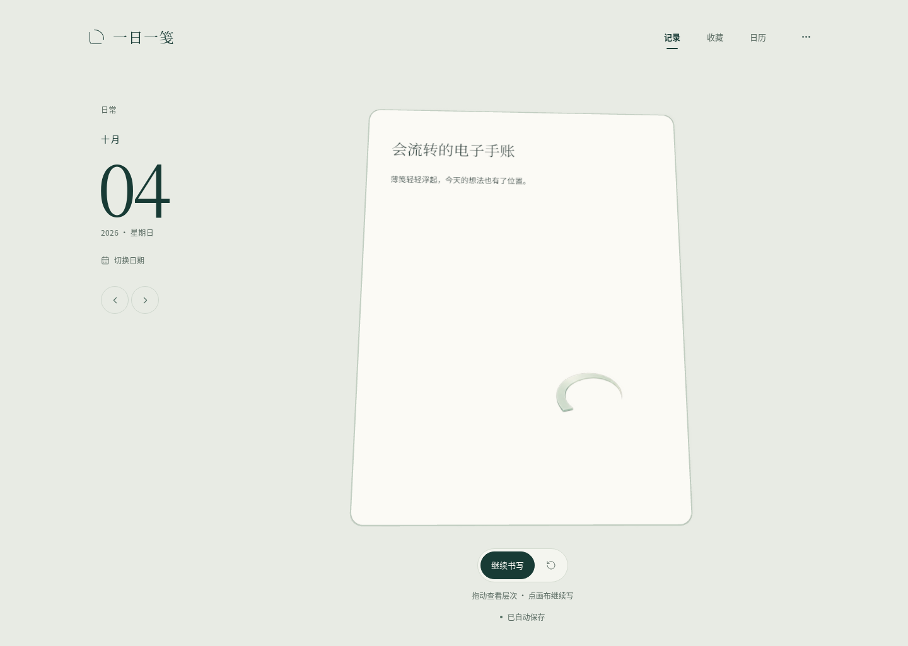
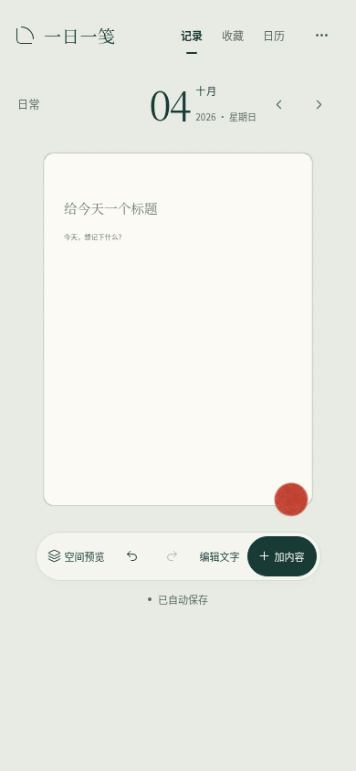
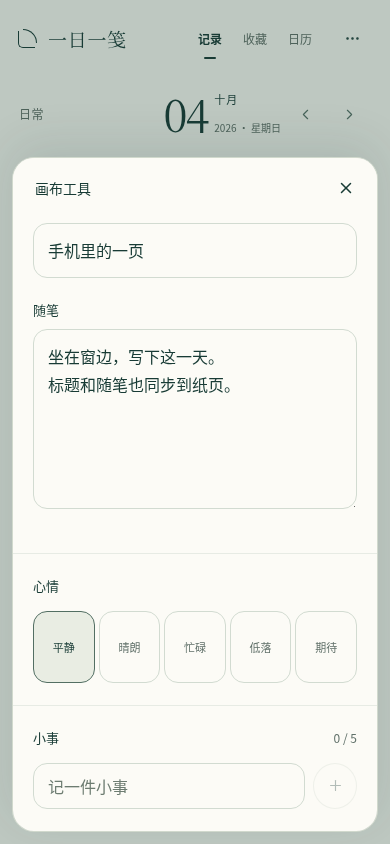

# 浮笺 · 数字手账

**0.6.0**：温玉 × 苍墨。日期侧栏、一张圆角数字画布与短操作区建立清晰主次；暖白、深青和薄玉材质贯穿界面与八件素材，空间预览可随时打开。


[查看操作 MP4](preview/journal-digital-demo.mp4) · [查看页面](preview/journal-desktop-editor.png) · [查看空间预览](preview/journal-desktop-space-preview.png)

## 下载与使用

| 文件 | 用法 |
| --- | --- |
| [电子手账 ZIP](https://github.com/liuqihang84-ui/111/raw/refs/heads/journal-playtest/downloads/yiri-journal.zip?v=0.6.0) | 约 6.5 MB，完整解压后打开 `yiri-journal.html` |
| [完整源码 ZIP](https://github.com/liuqihang84-ui/111/raw/refs/heads/journal-playtest/downloads/yiri-journal-source.zip?v=0.6.0) | React / TypeScript / Three.js、本地美术、锁文件、文档与测试 |

打开即可在当前日期写标题和正文。「编辑文字」打开大字号输入、心情与小事；「加内容」提供玉题签、玉界框、清流线、薄玉弧、玉索引、轻折片、玉叠片和玉朱点，也可以添加自己的照片。选中素材后可移动、缩放、旋转、调整层次或删除。

「空间预览」查看画面深度并拖动调整角度；「继续书写」回到稳定编辑。默认页面不自动加入装饰。「记录 / 收藏 / 日历」分别进入编辑、合集和回看；日期切换、撤销与重做保留。「浮笺旧藏」「印刷旧藏」与「旧藏」折叠保存此前素材，已有记录和旧 JSON 备份继续兼容。

空间预览使用本地 Three.js 与 WebGL 2；不可用时可继续记录。应用不调用 AI API，不在线下载字体、模型或材质。

## 页面与设计











[收藏](preview/journal-desktop-books.png) · [月历](preview/journal-desktop-calendar.png) · [默认页面](preview/journal-desktop-desk.png) · [实际录制元数据](verification/journal-digital-recording.json)

[UI / VI 规范](journal/docs/VISUAL-IDENTITY.md)、[薄玉图形来源与实际提示词](journal/docs/JADE-ART.md)、[美术来源](journal/docs/ART-SOURCES.md) 和 [空间引擎](journal/docs/3D-ENGINE.md) 随源码保留。演示来自当前应用的实际操作，录制构建 SHA 与交付 HTML 一致。

## 保存与验证

内容自动保存在当前浏览器，照片在浏览器内处理。「更多操作」可导出 1280 × 1680 PNG 分享图、备份和恢复全部记录的 JSON。切换设备、浏览器、地址或文件路径前请导出 JSON；恢复前自动下载当前备份，格式不合要求的文件不会覆盖记录。

这是可下载网页，尚未公开托管，没有账号或云端同步。当前托管浏览器限制 `file://`，验收通过真实 HTTP 载入与发布 HTML 相同的字节，再断网验证；保留管理策略。本地文件打开方式未在该环境实测，说明见包内 README。

本轮实际浏览器报告记录 **14 项通过，0 失败、0 跳过、0 不稳定**。单元报告记录 31 项通过，0 失败、0 跳过。 完整范围见 [QA.md](journal/docs/QA.md)、[DELIVERY.md](journal/docs/DELIVERY.md)、[浏览器 JSON](verification/journal-browser-report.json) 和 [单元 JSON](verification/journal-unit-report.json)。自动测试验证行为与资源，不替代视觉体验评价，也不推定所有设备的 WebGL 帧率。

```sh
cd journal
bash tools/install.sh
PORT=4180 bash tools/serve.sh preview
```

开发使用 `PORT=4180 bash tools/serve.sh dev`。[启动说明](journal/docs/START.md) 与完整字体、软件许可证随包保留。

此前 [中国美学工作台](https://github.com/liuqihang84-ui/111/tree/art-workbench)、[旧游戏交付](https://github.com/liuqihang84-ui/111/tree/game-playtest) 继续保留。
