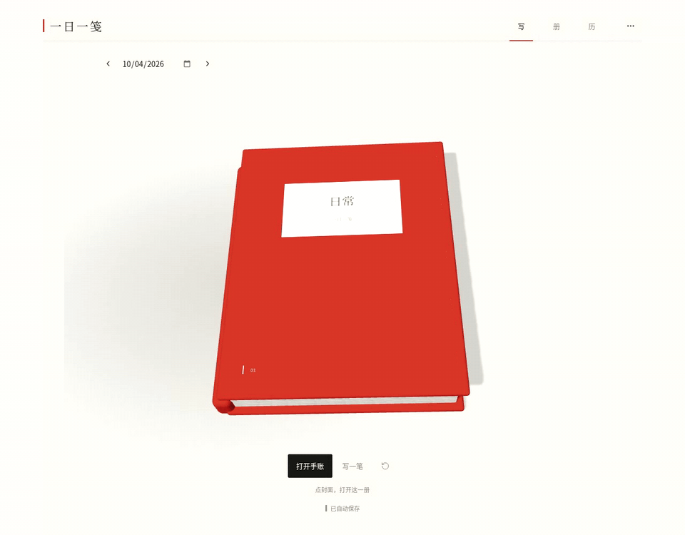
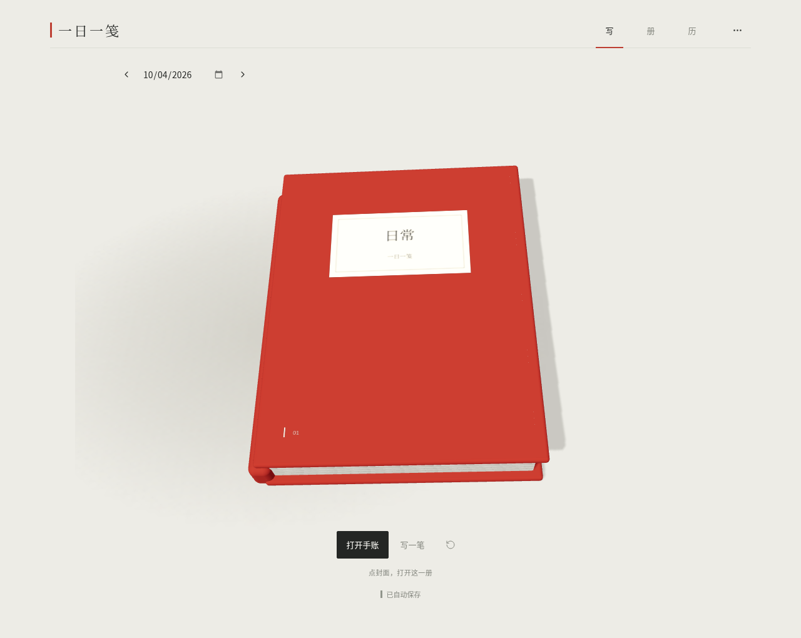
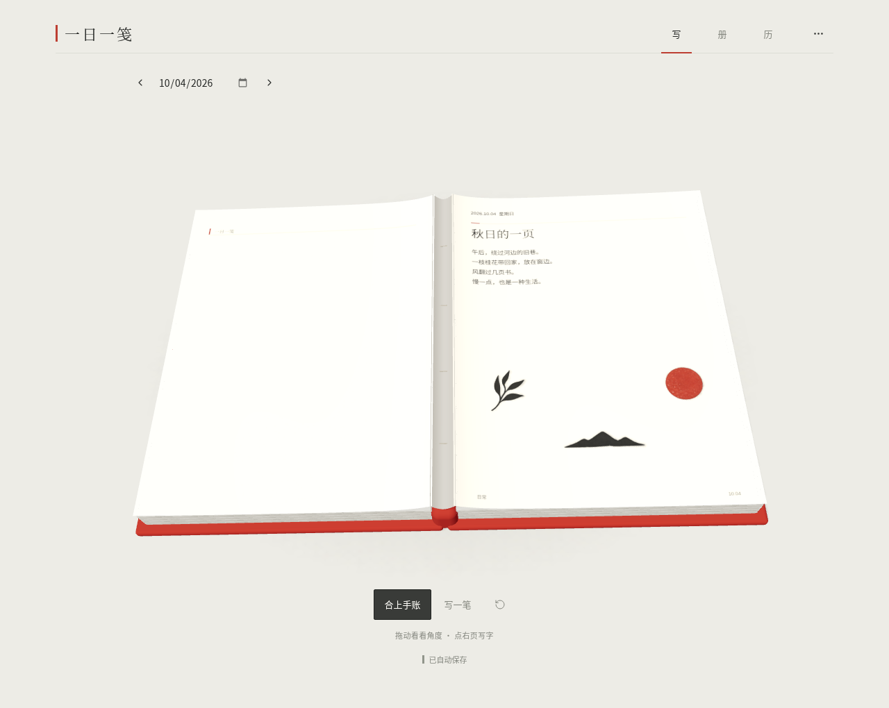
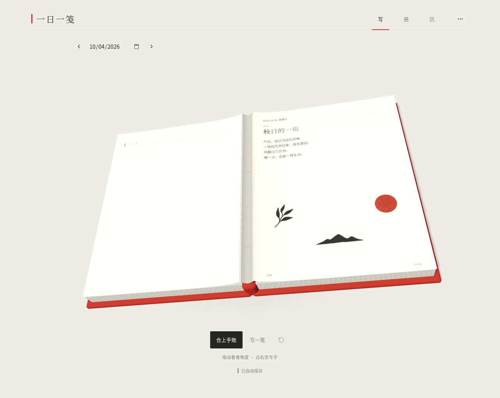
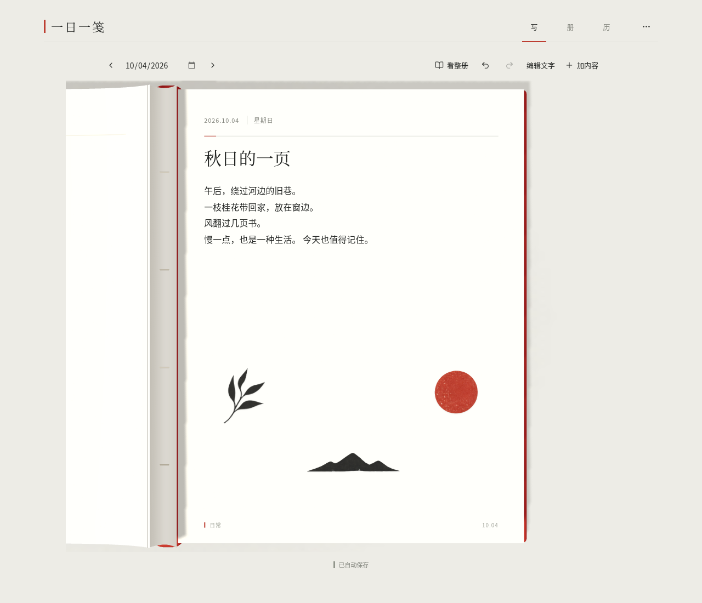

# 一日一笺 · 立体册页

**0.4.0**：这是可开合、拖动查看角度、真实翻页的电子手账。封皮、书脊、页芯和弯曲纸面由 Three.js 实时绘制；纸品与照片各自是独立薄片。纸白、墨黑和朱红继续贯穿封面、字标、纸品及编辑工具。

## 看实际动态操作



[下载这段实际操作 MP4](preview/journal-3d-demo.mp4) · [查看合拢册子](preview/journal-3d-closed.png) · [查看摆放后的页面](preview/journal-3d-composed.png)

演示来自当前应用实际操作，显示开合、拖动查看角度、翻页和进入原生书写的过程；[原始录制时间与错误记录](verification/journal-3d-recording.json) 一并保存。三维实现见 [3D-ENGINE.md](journal/docs/3D-ENGINE.md)。

## 下载与试用

| 文件 | 用法 |
| --- | --- |
| [电子手账网页 ZIP](https://github.com/liuqihang84-ui/111/raw/refs/heads/journal-playtest/downloads/yiri-journal.zip?v=0.4.0) | 约 5.9 MB。完整解压后打开 `yiri-journal.html` |
| [独立源码 ZIP](https://github.com/liuqihang84-ui/111/raw/refs/heads/journal-playtest/downloads/yiri-journal-source.zip?v=0.4.0) | React / TypeScript / Three.js、程序建模、本地美术、锁文件、文档与测试 |

新用户先看到一本「日常」的合拢手账。点封面或「打开手账」展开，拖动查看册子的角度；点击右页或「写一笔」进入当前页的直接编辑。「看整册」返回立体浏览，「复位视角」恢复默认构图。切换日期会翻动曲面纸页。

「写 / 册 / 历」切换工作区、收藏和月历。进入书写后，「加内容」打开八件印刷纸品与照片，「编辑文字」打开大字号输入、心情和小事。「更多操作」导出 PNG、备份和恢复 JSON，并设置封面。旧十二件材质小物保留在「旧藏」，已有手账与旧 JSON 备份继续兼容。

3D 浏览需要 WebGL 2。不可用时显示状态并继续普通书写；记录、保存与导出仍可使用。应用不调用 AI API，不下载外部模型、材质或字体。

## 真实页面截图










## 保存与导出

内容自动保存在当前浏览器，照片在浏览器内处理。PNG 为 1280 × 1680 平面册页分享图；JSON 可恢复全部册子、文字、照片和素材位置。切换设备、浏览器、地址或文件路径前请导出 JSON。恢复前自动下载当前备份，格式不合要求的备份不会覆盖原记录。

本版为可下载网页，尚未公开托管，没有账号或云端同步。当前托管浏览器限制 `file://`；验收通过真实 HTTP 载入与发布 HTML 相同的字节，再断网验证，保留管理策略。本地文件打开方式未在该环境实测，使用说明见包内 README。

## 验证与开发

本轮实际浏览器报告记录 **14 项通过，0 失败、0 跳过、0 不稳定**。本轮安装脚本实际完成 31 项单元测试；执行时间与构建记录见最终 QA 文档。 三维检查覆盖真实 WebGL 网格、相机角度、开合、曲面翻页和原生输入对齐；完整范围与实际报告见 [QA.md](journal/docs/QA.md)、[DELIVERY.md](journal/docs/DELIVERY.md) 和 [浏览器 JSON 报告](verification/journal-browser-report.json)。自动测试验证行为与资源，不替代视觉体验评价；软件 WebGL 验收结果不推定所有设备帧率。

```sh
cd journal
bash tools/install.sh
PORT=4180 bash tools/serve.sh preview
```

开发使用 `PORT=4180 bash tools/serve.sh dev`。[UI / VI 规范](journal/docs/VISUAL-IDENTITY.md)、[启动说明](journal/docs/START.md)、[美术来源](journal/docs/ART-SOURCES.md) 与 Three.js、字体的完整许可证随源码保留。

原 [中国美学工作台](https://github.com/liuqihang84-ui/111/tree/art-workbench)、[旧游戏交付](https://github.com/liuqihang84-ui/111/tree/game-playtest) 及此前文件继续保留。
