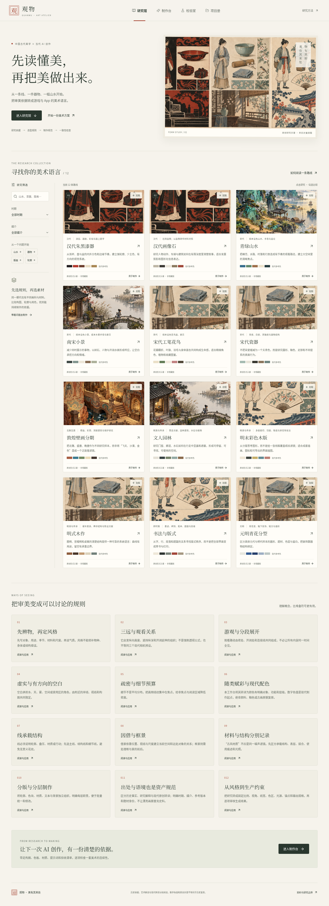
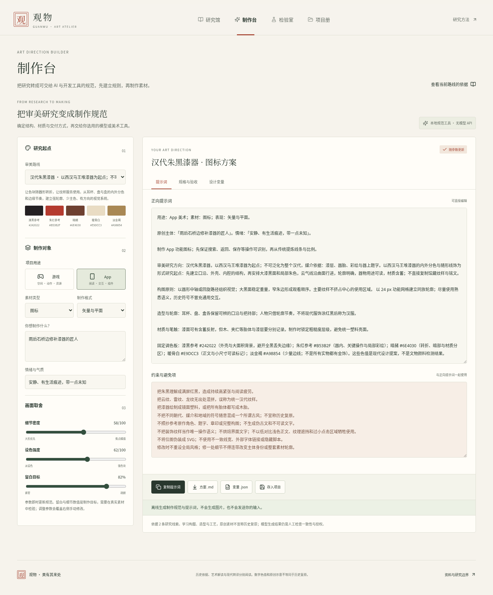
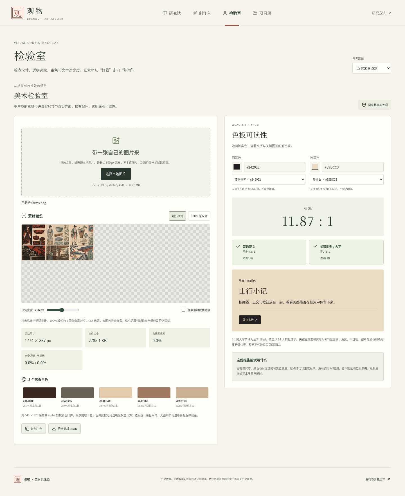

# 观物 · 中国美学与 AI 美术工作台

把中国古代美学研究与游戏、App 的实际美术制作放在同一个交互网页：研究为什么成立，整理怎样制作，再检查素材是否可用。

## 立即使用

**[下载交互网页 ZIP（约 7 MB）](https://github.com/liuqihang84-ui/111/raw/refs/heads/art-workbench/downloads/guanwu-art-workbench.zip)**

下载后解压，用 Chrome、Edge 或 Firefox 打开 `guanwu-art-workbench.html`。不用安装 Node、Godot 或游戏程序。页面内嵌图片与字体，核心工具不需要网络，点击博物馆资料链接时需要联网。

如果下载链接没有弹出文件，请进入 [ZIP 文件页面](downloads/guanwu-art-workbench.zip)，点击 **Download raw file**。也可以 [单独下载 HTML](https://github.com/liuqihang84-ui/111/raw/refs/heads/art-workbench/downloads/guanwu-art-workbench.html)。GitHub 文件预览不会直接运行 HTML，请下载后打开。

正式在线站点尚未启用；`docs/index.html` 已准备为静态托管入口，文件交付不代表 GitHub Pages 已上线。

## 四个工作区

| 工作区 | 可以做什么 |
| --- | --- |
| 研究馆 | 12 条美学路线，37 条参考线索；按时期、媒介与问题筛选，比较构图、造型、材质、设色与现代应用 |
| 制作台 | 将研究转为游戏/App 美术方案；编辑正向/负向提示词，导出 Markdown 交付规范和 JSON 设计变量 |
| 检验室 | 上传本地图片，检查尺寸、透明像素与主色，计算真实 WCAG 对比度，预览素材缩小后的表现 |
| 项目册 | 本地保存方案、恢复手动修改，导入/导出项目 JSON |

路线包括汉代朱黑漆器、汉代画像石、青绿山水、南宋小景、宋代花鸟、宋瓷、敦煌壁画、文人园林、明末彩色木版、明式木作、书法与版式、元明青花。

## 实际页面截图

这是浏览器运行截图，可以点击查看原图。

### 研究馆

[](preview/home-desktop.png)

### 制作台

[](preview/workbench-desktop.png)

### 检验室

[](preview/quality-desktop.png)

[查看手机页面](preview/home-mobile.png)

## 下载源码与研究方法

- [源码 ZIP](https://github.com/liuqihang84-ui/111/raw/refs/heads/art-workbench/downloads/guanwu-art-workbench-source.zip)
- [浏览源码与开发说明](art-workbench/README.md)
- [研究依据与转译方法](art-workbench/docs/research-method.md)
- [美术与字体来源](art-workbench/docs/ART-SOURCES.md)
- [实际验收结果与运行说明](art-workbench/docs/DELIVERY.md)
- [下载文件校验值](downloads/delivery-manifest.json)

开发启动：

```sh
cd art-workbench
npm ci
PORT=4173 bash tools/serve.sh dev
```

## 当前完成范围

类型检查、生产与单文件构建通过；14 项单元测试、8 项浏览器检查通过，没有跳过或浏览器异常。离线检查以相同字节的交付 HTML 经允许的 HTTP 加载、刷新后断网完成。云端 Chromium 管理策略阻止 `file://`，本地文件模式尚未在此环境实测；未修改管理策略。

本版本提供研究、规范生成与素材检查，尚未接入在线 AI 出图 API。项目与图片在浏览器本地处理；请导出项目 JSON 保留备份。

37 条来源均标为 `reference`：已提供具体作品/文献线索与官方检索入口，但受云环境网络限制，未逐件在线核验馆藏。原创研究板与现代色值是设计示意，不能视为历史复原。详细核验边界保留在研究文档中。

本分支保留此前的概念美术资料；游戏试玩仍位于独立的 `game-playtest` 分支。

## 前期独立美术研究存档

2026-10-03（Asia/Shanghai）。目前只研究美术，游戏类型以后再定。下列为原创生成辅助的研究稿，没有接入游戏，也不作为历史复原图。

## 第二轮：人物、器物与造型语言

**[打开图片文件页面](https://github.com/liuqihang84-ui/111/blob/concept-art/docs/concepts/chinese_aesthetics_forms_v02.png)** · **[直接打开或下载PNG原图](https://raw.githubusercontent.com/liuqihang84-ui/111/refs/heads/concept-art/docs/concepts/chinese_aesthetics_forms_v02.png)**


从左至右：

1. **朱黑与刻线**：以汉代漆器和画像石为研究线索，比较轮廓、面积和器物曲面。
2. **细线与清润材料**：以宋画、生活器物和陶瓷为线索，比较观察、衣褶、局部设色与材料。
3. **线版与有限套色**：以明末彩色木版画为线索，比较线层、色层和纸面空白。

[第二轮详细研究与待修正部分](docs/aesthetics-form-study-v02.md)。人物服装、纹样和建筑均为试探性原创组合，尚未确定角色或整体方向。

## 第一轮：山水与空间参考

[打开第一轮研究图](docs/concepts/chinese_aesthetics_triptych_v01.png) · [第一轮研究说明](docs/chinese-aesthetics-study.md)


[早期角色与森林参考存档](docs/concepts/preview.md)。早期开发游戏包保留在独立game-playtest分支，本轮没有更新游戏代码或安装包。

如图片没有显示，请点原图链接；也可在图片文件页面选择 **Download raw file / 下载原始文件**。
