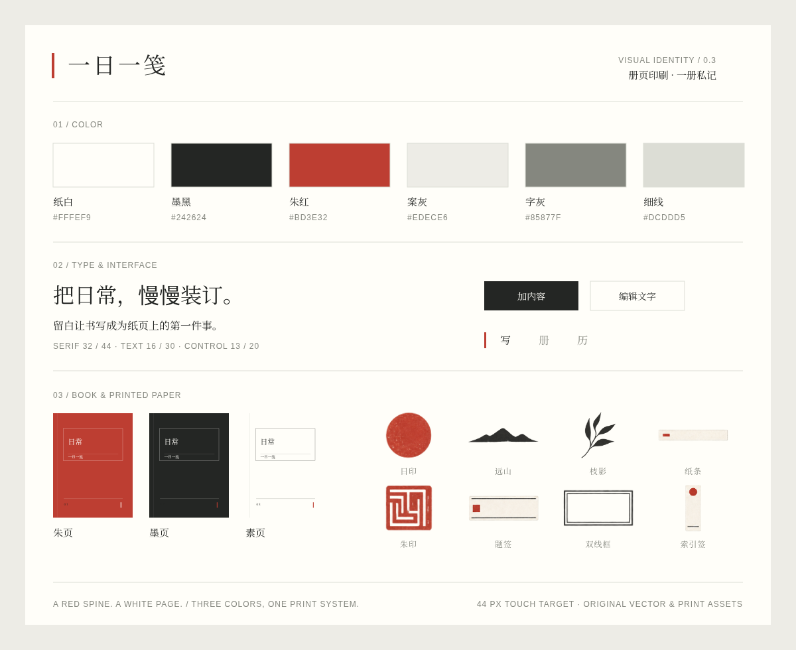
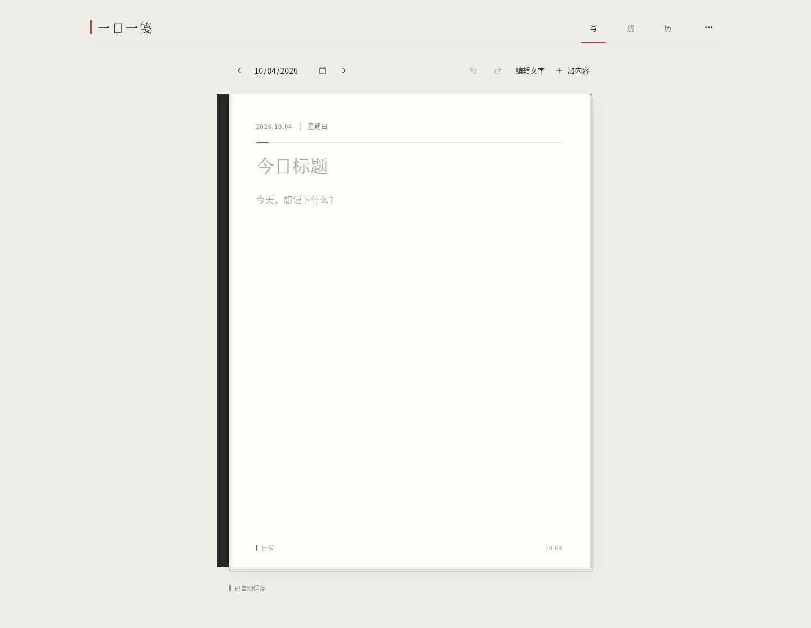
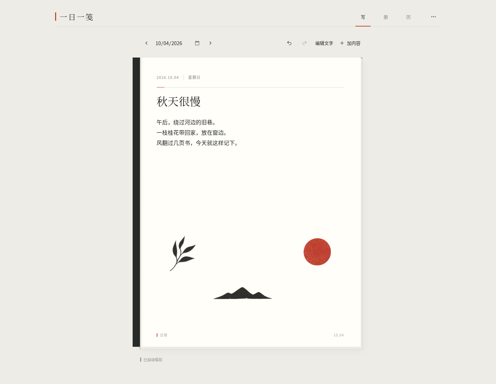
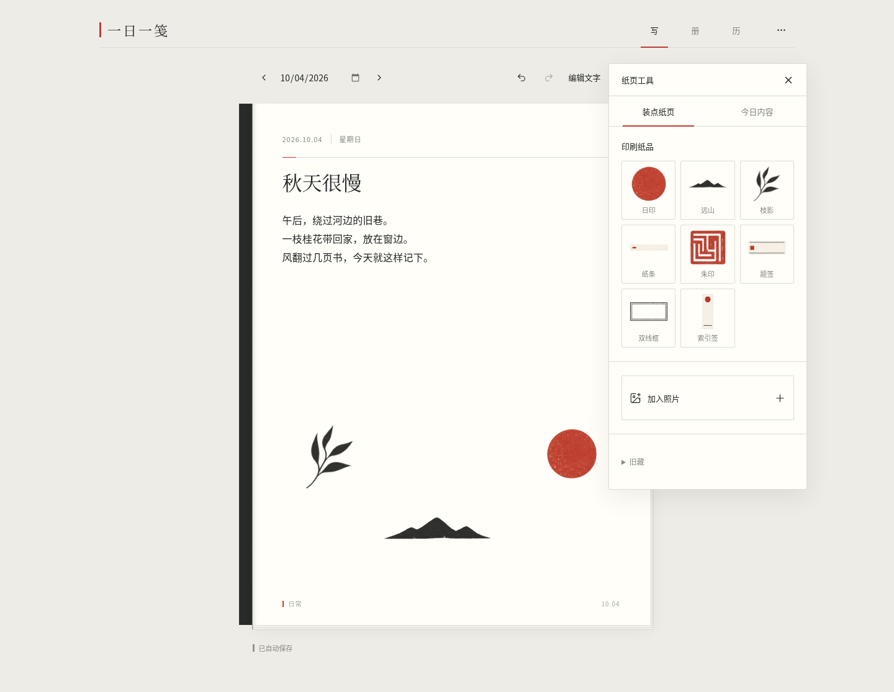
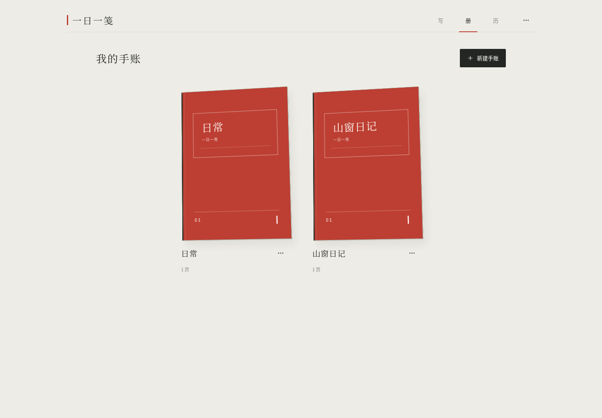
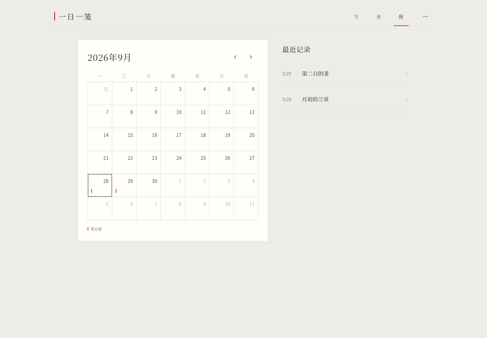

# 一日一笺 · 印刷私记

**0.3.0**：纸白、墨黑、朱红的一套册页设计。新用户直接打开一本「日常」的空白页，点击标题与随笔开始写；素材、心情、待办和备份按需打开。已有数据及旧版 JSON 备份保留兼容。

## 下载与试用

| 文件 | 用法 |
| --- | --- |
| [电子手账网页 ZIP](https://github.com/liuqihang84-ui/111/raw/refs/heads/journal-playtest/downloads/yiri-journal.zip?v=0.3.0) | 约 5.7 MB。完整解压后打开 `yiri-journal.html` |
| [独立源码 ZIP](https://github.com/liuqihang84-ui/111/raw/refs/heads/journal-playtest/downloads/yiri-journal-source.zip?v=0.3.0) | React / TypeScript、原创美术、锁文件、文档与测试 |

「写 / 册 / 历」切换纸页、收藏和月历。「加内容」打开八件印刷纸品与照片，「编辑文字」打开大字号输入、心情与小事。「更多操作」导出 PNG、下载或恢复 JSON，并设置封面。

## 视觉规范与实际截图

字标、窄书脊、题签、细线和编号组成统一视觉体系；朱红标记身份和当前状态，墨黑用于主要操作。册页保留薄纸边和轻投影，封面使用克制的 CSS 3D 厚度。八件新纸品同系列；旧十二件材质小物收进「旧藏」。















## 保存与导出

内容自动保存在当前浏览器，照片在浏览器内处理。PNG 为 1280 × 1680 展示图；JSON 恢复全部册子、文字、照片和素材位置。切换设备、浏览器、地址或文件路径前请导出 JSON。恢复前自动下载当前备份，格式不合要求的备份保留原记录。

本版为可下载网页，尚未公开托管，没有账号或云端同步。当前托管浏览器限制 `file://`；验收通过真实 HTTP 载入与发布文件相同的字节，再断网验证，保留了管理策略。本地文件打开方式未在该环境实测，使用说明见包内 README。

## 验证与开发

锁定依赖安装、31 项单元测试、TypeScript、生产与离线构建通过。13 项实际浏览器验收通过，失败、跳过及不稳定均为零；包括空白初始页、三种封皮、透明纸品、实际拖动/手柄缩放/撤销重做、照片与 PNG 像素、JSON 恢复、手机真实触摸和断网使用。结果见 [QA.md](journal/docs/QA.md) 与 [DELIVERY.md](journal/docs/DELIVERY.md)。自动测试验证行为与资源，不替代视觉体验评价。

```sh
cd journal
bash tools/install.sh
PORT=4180 bash tools/serve.sh preview
```

开发使用 `PORT=4180 bash tools/serve.sh dev`。[视觉规范](journal/docs/VISUAL-IDENTITY.md)、[启动说明](journal/docs/START.md)、[美术来源](journal/docs/ART-SOURCES.md) 和完整许可证随源码保留。

原 [中国美学工作台](https://github.com/liuqihang84-ui/111/tree/art-workbench) 及旧游戏成果保留。
