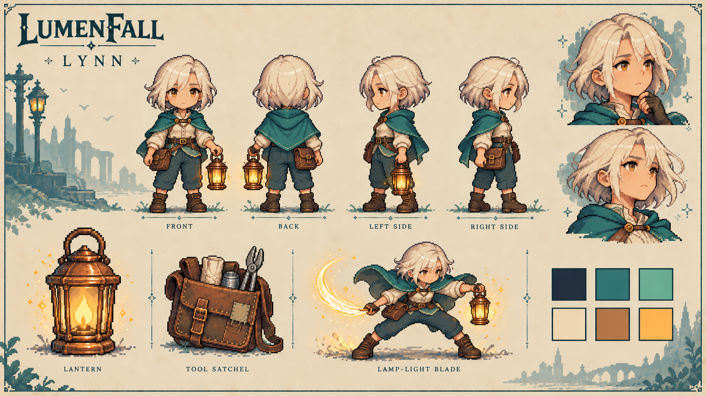
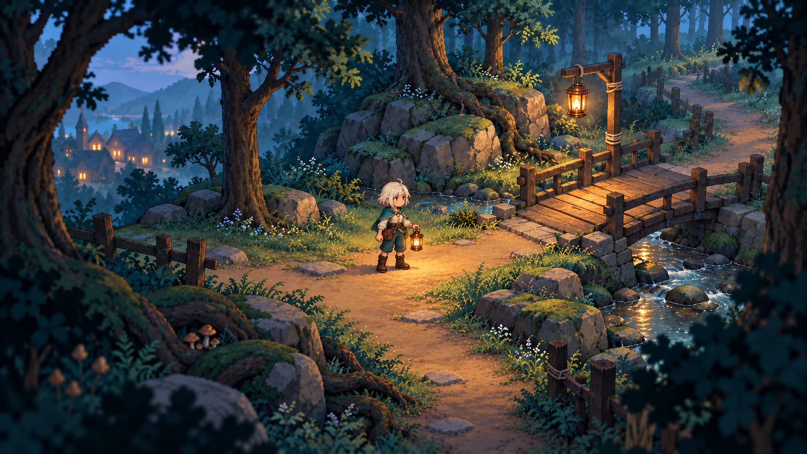
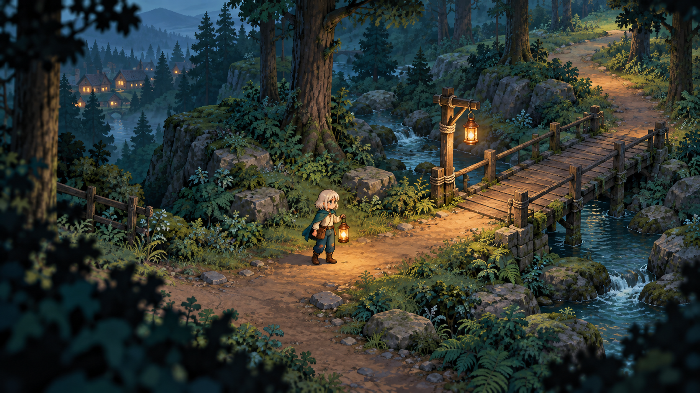

# 第一轮角色与森林概念图

日期：2026-10-02（UTC）。本页保留第一轮讨论记录。2026-10-03（Asia/Shanghai），用户认可林恩 v02 与森林 v03 的方向并授权全面设计和开发，当前进度见[内容制作记录](../production-design.md)。主线五小时以上仍为需要首次试玩验收的目标。

本轮把[角色与美术规范](../art-direction.md)转成可见画面，先检查林恩的身份、角色比例和森林的空间层次。图片没有接入 Godot；场景图不是游戏截图，角色板也不是可直接导入的动画图集。

## 当前评审版本

| 图片 | 内容 | 本轮调整 |
| --- | --- | --- |
| [林恩角色设定 v02](lynn_character_v02.png) | 正、背、左右侧服装参考，两种头像表情，铜灯、工具包与光刃姿态 | 从初稿的修长比例调整为约三头身，减少披风装饰，保留米白短发、青绿披风和实用衣装 |
| [M01 村外林径 v02](forest_m01_v02.png) | 蓝绿暮色森林、林恩、暖灯、小桥与连续道路 | 使用角色 v02 统一人物比例，简化可行走主路的细碎纹理 |

初稿保留作比较：[角色 v01](lynn_character_v01.png)、[森林 v01](forest_m01_v01.png)。v02 是本轮建议的评审版本，尚未作为最终美术定稿。

### 补充森林概念 v03

2026-10-03（Asia/Shanghai）补充[森林 v03](forest_m01_v03.png)。这一版按照相同角色、冷暖配色与路线要求独立重新生成，没有输入旧图片；原 v02 保留供比较。v03 仍为讨论用概念图，没有接入引擎，也不替代正式像素素材。

## 看图时的修改对照表

以下 A 编号只用于本轮美术反馈，与总策划的 01～58 编号分开。可以直接写“ A01 更成熟一些，A06 更明亮一些”，其余保持当前方向。

| 编号 | 本轮建议 | 可以调整的方向 |
| --- | --- | --- |
| A01 人物比例 | 约三头身，短腿、清楚脚点，适合远距离游戏画面 | 更圆润亲近，或略拉长躯干与腿部；四面与场景人物需同步 |
| A02 面部与气质 | 19 岁学徒，谨慎、认真，带少许倔强 | 更成熟利落，或更温柔；保留年龄与短发身份特征 |
| A03 头发 | 米白、不对称短发，远看轮廓清楚 | 更整齐的短发，或稍蓬松的发束；避免过多细碎尖刺 |
| A04 披风与衣服 | 青绿短披风、浅色上衣、深青裤、褐色短靴，少量修补 | 调整下摆、领口、披风深浅和磨损；保持腿部与装备可见 |
| A05 铜灯与工具包 | 旧而认真养护的手工铜灯，暖琥珀火，右腰工具包 | 圆润灯体或更方正灯框、大小与磨损程度；左手灯和右腰包仍按身体左右定位 |
| A06 森林色调 | 蓝绿暮色与暖金灯火，神秘但有希望 | 降低饱和度增加孤独感，或略提亮草木增加童话感 |
| A07 环境细节 | 主路安静，细节集中在树根、岩石、溪岸与画面边缘 | 整体更简洁，或外围更丰富；人物脚边和路线开口保持清楚 |
| A08 镜头与氛围 | 斜俯视，近景框景、中景行动、远景退色 | 拉近人物或拉远展示环境，调整边缘柔化和远景雾感；实际镜头参数留待 Godot 试景 |

## 本轮画面说明

林恩的铜灯与工具包以角色身体左右为准：正面铜灯在观看者右边，背面在观看者左边。侧面需要考虑远侧装备遮挡，后续像素制作时逐帧核对，不能直接镜像整张人物。

森林选用第一章 M01，而不是 Boss 区域。路灯新绳结对应导师留下的维修痕迹；小桥、溪流和远处村屋只是本轮构图草案，不增加地图、任务或剧情门槛。道路从前景进入中景，经桥延续至森林深处，近景树冠不遮住林恩或桥头。

当前图可用来评审轮廓、配色、装备和空间组织。画布内的角色没有按最终 32×48 像素逐点制作；头像也没有裁成正式 128×128 资产。像素网格、透明边缘、四向动作、足底锚点、精确 HEX 配色和装备遮挡仍须在正式素材制作中落实。

场景的光晕、雾感与边缘柔化只表达视觉意图。Compatibility 渲染下的实现、关闭增强后的可读性和实际设备性能仍按美术规范在后续试景验证，本轮不声称通过引擎验收。

## 生成来源与设计简报

制作方式：由本轮策划文字指导 OpenAI 图像生成工具生成及修订，使用项目自己的前版概念图作为后续参考，没有输入参考游戏的角色、贴图或截图。原始输出保留在 `/workspace/generated_images/`，此目录保存仓库副本。工具返回未标注独立许可证；这些文件目前登记为讨论用概念稿，尚未登记为发行素材。

| 文件 | 参考输入 | 设计简报 |
| --- | --- | --- |
| `lynn_character_v01.png` | 无；文字生成 | 原创 Lumenfall 主角板：四面衣装、两种表情、铜灯和工具包细节、临时灯火光刃、六色色板；浅羊皮纸背景、像素插画，铜灯左手、工具包右腰 |
| `lynn_character_v02.png` | 角色 v01 | 保持身份、版面和装备，放大头部与缩短腿部至约三头身，减少披风金色装饰，简化裤装纹理 |
| `forest_m01_v01.png` | 角色 v01 | 原创 M01 村外林径，正交斜俯视的 HD-2D 方向；像素人物置于有体积的树根、岩石、道路和木桥；冷蓝绿环境与暖灯，前中远三层，无 UI |
| `forest_m01_v02.png` | 森林 v01、角色 v02 | 保持构图和配色，用角色 v02 的紧凑比例替换人物，减少主路碎石与高对比细点，保留中景清晰度、路线和修补路灯 |
| `forest_m01_v03.png` | 无；文字重新生成 | 同一 M01 场景方向：米白短发与青绿披风的三头身学徒，左手铜灯、右腰工具包；蓝绿森林、暖灯、小桥、连续低噪声路径和前中远景，无 UI |

下一轮仍可在设计阶段调整人物与森林，再依次设计岑灯、阿芙、小禾及灯火村。正式动画、游戏素材与编码另行开展。
