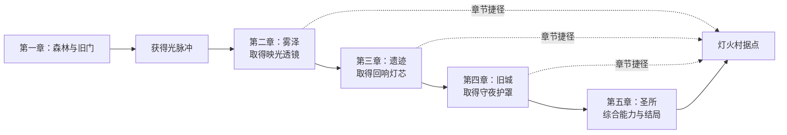

# 《暮光之森》游戏策划基线 v0.3

日期：2026-10-03。当前阶段：用户已授权完成全盘设计并直接制作游戏，进入实现与验证。

本文件记录用户确认的方向，并把这些方向转成可讨论的制作规格。所有地图、数值和交付清单描述的是目标设计；现有实验原型不代表这些内容已经实现。角色名字、具体任务和数值属于本轮细化草案，可以继续修改。

## 1. 已确认的方向

- 使用 Godot，采用 HD-2D 视觉表现。
- 主线至少五小时，设计目标为首次正常游玩 **5～7 小时**；主线加支线与隐藏探索的总时长约 7～10 小时。
- 延续前一版提案的单机动作冒险、女性守灯人学徒、温暖森林奇幻题材和轻量成长方向。
- 按已认可的林恩与森林概念完成全盘设计，随后直接实现；日常设计和实现选择由开发方推进。

工作名：**暮光之森 / Lumenfall**。

一句话概念：守灯人学徒林恩带着导师留下的铜灯，穿越暮色中的森林与遗迹，追寻导师的去向，重新点亮连接村庄的灯塔。

## 2. 设计支柱

| 支柱 | 玩家得到的体验 | 制作时检查什么 |
|---|---|---|
| 灯连接玩法和故事 | 举灯看见隐藏的痕迹，灯的能力同时用于战斗和机关 | 每项灯能力有明确的探索与战斗用途 |
| 探索产生发现 | 转过一条林径会发现路线、角色线索或新的地标 | 主路与支路可辨识，回访有捷径与新收获 |
| 战斗可观察、可学习 | 敌人先预告再攻击，失误后有重试机会 | 预告、有效伤害范围和实际碰撞一致 |
| 暮色里有温度 | 冷色环境中始终有暖色灯火和人物牵挂 | 灯的视觉语言、角色关系和结局情绪一致 |

核心循环：探索区域 → 找到线索 → 战斗或解谜 → 获得灯火能力 → 打开新路线 → 返回篝火整理与保存 → 推进下一章。

## 3. 内容规模

| 内容 | 目标数量／规则 |
|---|---|
| 主线 | 五章、一个完整结局 |
| 地图 | 15 张：1 张村庄据点 + 14 张冒险地图 |
| 地域 | 村庄据点 + 森林、雾泽、遗迹、旧城、圣所五个冒险区域 |
| 可控角色 | 林恩 1 名 |
| 重要 NPC | 导师岑灯、商人阿芙、孩子小禾 3 名；少量背景村民 |
| 普通敌人 | 10 种行为类型，跨区域适度复用 |
| 主要 Boss | 5 个，每章 1 个 |
| 支线 | 8 个，均发生在已有地图中 |
| 成长与物品 | 剧情能力升级、灯芯生命成长、6 种护符、治疗道具、少量货币 |
| 界面 | 标题、暂停、设置、背包、护符、任务记录、区域地图、对话 |
| 存档 | 3 个槽位，篝火／关键剧情／正常退出自动保存 |
| 音频 | 标题、村庄、探索、战斗和结局等约 6～8 个音乐主题，区域变奏与环境音 |

音乐采用既有主题的区域变奏控制制作量。上一版约 6 首主题仍作为基础预算；最终曲目数量随章节演出确定。

## 4. 五章与能力依赖

| 章 | 地点／地图 | 剧情目标 | 主要成长 | 正常首次游玩目标 |
|---|---|---|---|---|
| 一：最后的灯火 | M00 据点，M01～M03 暮光森林 | 找到导师留下的第一条线索，打开旧门 | 基础攻击、闪避、举灯；章末获得光脉冲 | 60～75 分钟 |
| 二：雾中的回声 | M04～M06 雾泽 | 找出雾中安全路径，追踪回声 | 在 M05 获得映光透镜，供 M06 的隐路机关使用 | 60～75 分钟 |
| 三：沉没的记忆 | M07～M09 遗迹 | 理解灯塔为何熄灭 | 在 M08 获得回响灯芯，供 M09 的符文连接使用 | 65～85 分钟 |
| 四：无灯之城 | M10～M12 旧城 | 理解导师的选择，取得修复灯塔的条件 | 在 M11 获得守夜护罩，供 M12 战斗综合使用 | 65～85 分钟 |
| 五：微光归来 | M13～M14 圣所 | 找到导师、完成最终挑战、点亮灯塔 | 综合已有能力，完成成长与故事 | 60～85 分钟 |

设计时长合计 **310～405 分钟（5 小时 10 分～6 小时 45 分）**。这是关卡设计和试玩的目标分配，不是已测得的游玩数据。主线时间包含正常探索、对话、机关与战斗；可选支线、挂机、反复刷怪和大量重复死亡不计入主线内容目标。

门槛顺序必须遵循“先获得能力，再出现强制使用该能力的门”。主线物件永久登记，机关不永久消耗关键物件；章节完成后，在现有地图内解锁返回村庄的捷径。

## 5. 问答需求对照

| 编号 | 采用的设计基线 |
|---|---|
| 01 | Godot 4.6.3、GDScript；版本升级另行评估。 |
| 02 | 像素角色 + 有纵深的 3D 场景 + 正交镜头 + 适度氛围效果。 |
| 03 | 探索与剧情为主的动作冒险，轻量成长。 |
| 04 | Windows 首发，Linux 开发和兼容验证。 |
| 05 | 喜欢像素、短中篇故事和适度战斗的玩家。 |
| 06 | 参考《八方旅人Ⅱ》的视觉层次、《TUNIC》的探索清晰度与战斗反馈。 |
| 07 | 灯光连接战斗、机关、隐藏道路与守灯人故事。 |
| 08 | 主线至少 5 小时，目标 5～7 小时。 |
| 09 | 首个 10～15 分钟验证片段；随后完成完整第一章和其余章节。 |
| 10 | 探索、线索、战斗／机关、能力成长、路线解锁、篝火保存的循环。 |
| 11 | 即时动作战斗，攻击预告明确，观察和闪避重要。 |
| 12 | 键盘与手柄，支持改绑。 |
| 13 | 一名可控主角；NPC 通过故事陪伴。 |
| 14 | 普攻、闪避、光脉冲、举灯、互动。 |
| 15 | 灯光显形、符文机关、隐藏小径、宝箱、背景碎片。 |
| 16 | 剧情灯能力、灯芯生命成长、护符。 |
| 17 | 小背包、治疗品、少量货币、一个商店、6 种护符。 |
| 18 | 篝火重生，任务与永久收集保留，生命恢复。 |
| 19 | 剧情／标准／挑战三档，主要调整战斗参数与辅助提示。 |
| 20 | 森林奇幻：村庄、雾泽、遗迹、旧城、古树圣所。 |
| 21 | 林恩寻找导师、修复灯塔、阻止暮色侵蚀。 |
| 22 | 温暖、孤独、悬疑，结局落在希望与传承。 |
| 23 | 线性主线、自由探索与少量对话选择，一个结局。 |
| 24 | 主角 1、重要 NPC 3、背景村民少量。 |
| 25 | 村庄据点与五个相连的冒险区域，支持回访。 |
| 26 | 15 张地图，具体清单见世界文档。 |
| 27 | 五章主线与 8 支线，探索／对话／战斗／机关共同推进。 |
| 28 | 10 类普通敌人、5 个主要 Boss。 |
| 29 | 完成古树圣所、修复灯塔、找到导师并返回村庄。 |
| 30 | 冷环境与暖灯火，细节精致、轮廓清楚。 |
| 31 | 斜俯视正交镜头，平缓跟随，Boss 场地稳定取景。 |
| 32 | 重要角色与标志性资产原创，通用资产可使用授权素材。 |
| 33 | 音乐、环境与动作音效；文字对白配简短语气音。 |
| 34 | 标题、暂停、设置、背包、护符、任务、地图、对话。 |
| 35 | 3 槽自动存档，篝火／关键剧情／正常退出保存。 |
| 36 | 改绑、音量、字号、震动、景深；形状与颜色共同表达预告。 |
| 37 | 单机，简体中文首发，文本保留本地化接口。 |
| 38 | 暂按 1 主开发 + 按需美术支持、完整版 6～9 月规划；成本待验证片段后估算。 |
| 39 | 免费短篇首发 itch.io；1080p/60 FPS，低配 720p/30 FPS 的性能目标。 |
| 40 | 完整通关、存读档、重试、可读画面、稳定性能与独立发行包。 |
| 41 | 林恩，19 岁女性，守灯人学徒。 |
| 42 | 细心、倔强、有责任感，从担忧职责到独立判断。 |
| 43 | 约三头身，服装与动作有可信重量。 |
| 44 | 米白短发、青绿披风、铜灯、工具包、灯火光刃。 |
| 45 | 青绿身份色、米白面部亮色、琥珀灯火。 |
| 46 | 岑灯深色沉稳、阿芙暖褐热情、小禾浅色好奇紧张。 |
| 47 | 暮影生物与遗迹造物，轮廓反映行为。 |
| 48 | 四方向基础动画，包含攻击、闪避、技能、受伤、倒下、举灯互动。 |
| 49 | 像素层次、场景纵深与童话绘本色彩的组合参考。 |
| 50 | 暮色中的温暖灯火，神秘环境与亲近角色。 |
| 51 | 主角 32×48 基础网格，有限色阶、清楚轮廓，远景简化。 |
| 52 | 木材／铜灯村庄、苔藓根系森林、风化石块与符文遗迹。 |
| 53 | 各区域有配色变化，琥珀灯火跨区域统一。 |
| 54 | 约 45° 斜俯视，战斗清晰，远景与边缘轻微景深。 |
| 55 | 像素光刃弧、柔和灯光、动作和地面形状共同预告敌方攻击。 |
| 56 | 深蓝绿界面、细金边、米白文字、像素图标与半身头像。 |
| 57 | 透明 PNG、统一网格与锚点、128×128 头像、512/1024 场景贴图。 |
| 58 | 先主角与色板、再代表场景、再批量内容；资产记录来源与授权。 |

## 6. 第一轮可玩验证片段

开发恢复后的第一目标是一个 10～15 分钟片段，覆盖村庄的简短对话、林径探索、基础战斗、一个灯光机关和精简守卫战。片段可以使用 M00/M01/M03 的局部测试区域，完整第一章仍按 M00→M01→M02→M03 顺序展开。

此片段用于验证玩法与美术是否协调；它不是完整第一章，也不代表五小时内容已经成立。用于验证光脉冲的测试场景可单独提供能力，正式流程仍按章一结束授予。

片段交付物：代表性场景、基础输入与战斗、一个可互动 NPC、任务提示、存档与重试、键盘及手柄验证、Windows 可运行包、试玩记录。

## 7. 制作阶段与验收

| 阶段 | 产出 | 进入下一阶段的依据 |
|---|---|---|
| 设计细化 | 总纲、世界地图清单、系统规格、角色与美术规范 | 关键规则相互一致，重要剧情和视觉方向可讨论 |
| 视觉与玩法验证 | 角色样稿、代表场景、10～15 分钟片段 | 角色可辨、操作顺畅、战斗预告有效、整体画面一致 |
| 完整第一章 | 章一全部地图、任务、Boss、保存／返回流程 | 第一次正式试玩验证节奏与内容制作速度 |
| 五章内容制作 | 所有地图、任务、成长、Boss、结局 | 全流程连续通关，任务状态和存档跨地图可靠 |
| 内容与性能调整 | 节奏、难度、美术统一、音频、性能与易用性 | 正常首玩主线目标达到五小时以上，减少重复与等待 |
| 发行准备 | Windows 独立包、许可清单、说明、测试记录与商店素材 | 全新机器安装运行、游戏闭环和发布材料完成 |

首个片段原规划约 4～6 周、完整版本约 6～9 月，均是基于单主开发与按需美术支持的工作量占位。最终工期和素材预算，在完成验证片段并统计实际地图、动画和对话制作速度后重新估算；当前没有确定的发行日期。

## 8. 验证原则

- 游戏规则：伤害、闪避、能力门槛、任务奖励幂等、死亡恢复与存档兼容。
- 关卡流程：每章进入、关键能力取得、Boss 完成、返回据点、跨地图保存后继续。
- 画面可读：角色和地面区分、遮挡淡化、危险预告、文本字号、键盘与手柄提示。
- 性能：代表性高负载场景实测，再确定最低硬件要求；当前 FPS 是目标，不是实测结论。
- 时长：记录独立试玩者首次正常通关的章节时间，分别统计探索、剧情、机关、战斗和重复尝试。若内容不足，补充有发现与变化的内容，而非增加同类重复。

## 9. 配套文档与接下来的讨论

- [世界与剧情](story-and-world.md)：15 图、五章流程、八支线和五 Boss。
- [玩法系统](gameplay-systems.md)：战斗、成长、存档、易用性与验证片段。
- [角色与美术](art-direction.md)：角色设定、区域色板、资产规范和代表性场景。

用户已认可林恩与冷森林／暖灯火的整体感觉，并授权完成全盘设计后直接制作。后续以[制作设计](production-design.md)与实际构建验证记录区分目标内容和已实现内容；人物细节与参数在玩法测试中持续调整。
