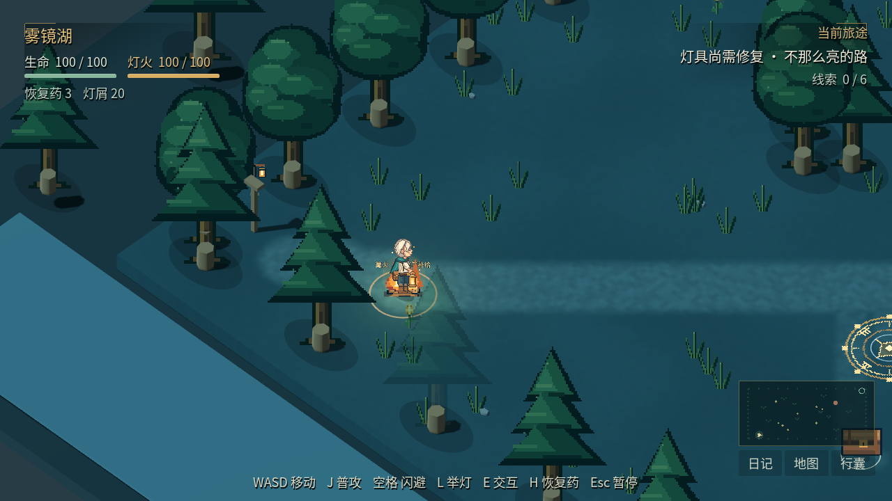
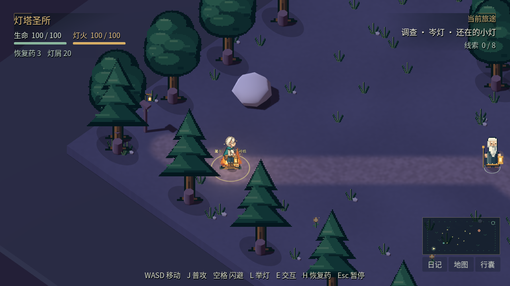

# 暮光之森开发测试版下载

最新版为 **0.3.1-dev 画面改进版**：新角色、纹理地表、路缘植被、溪桥灯光与紧凑 HUD 已接入实际游戏。[先看实机前后对比](visual-comparison.md)。

完整解压后再运行，独立游戏无需安装 Godot。

| 平台 | 浏览器直接下载 | 文件页面备用入口 | 大小 |
| --- | --- | --- | --- |
| Windows x86_64 | [下载 ZIP](https://github.com/liuqihang84-ui/111/raw/refs/heads/game-playtest/downloads/lumenfall-0.3.1-dev-windows-x86_64.zip) | [打开文件页面](https://github.com/liuqihang84-ui/111/blob/game-playtest/downloads/lumenfall-0.3.1-dev-windows-x86_64.zip) | 57.2 MB |
| Linux x86_64 | [下载 ZIP](https://github.com/liuqihang84-ui/111/raw/refs/heads/game-playtest/downloads/lumenfall-0.3.1-dev-linux-x86_64.zip) | [打开文件页面](https://github.com/liuqihang84-ui/111/blob/game-playtest/downloads/lumenfall-0.3.1-dev-linux-x86_64.zip) | 48.4 MB |
| 源码、素材及完整设计 | [下载 ZIP](https://github.com/liuqihang84-ui/111/raw/refs/heads/game-playtest/downloads/lumenfall-0.3.1-dev-source.zip) | [打开文件页面](https://github.com/liuqihang84-ui/111/blob/game-playtest/downloads/lumenfall-0.3.1-dev-source.zip) | 50.0 MB |

如果直接下载没有开始，请打开备用文件页面并点击右上方 **Download raw file / 下载原始文件**。如 GitHub 提示登录，请使用有权访问此仓库的账号。

Windows：解压后双击 `lumenfall.exe`，旁边的 `lumenfall.pck` 必须保留。该包在 Linux 云环境导出，尚未在 Windows 实机运行。开发版未做代码签名，可能显示 SmartScreen 未识别应用提示；签名与信誉问题仍未解决。

Linux：解压后运行 `./lumenfall.x86_64`，需要图形桌面与 OpenGL 3.3 驱动。0.3.1 真实独立程序键鼠验收 **7/7** 通过，包括新建、移动、保存、读档和正常退出；发行 PCK 检查 **14/14** 通过。

本轮没有改变存档结构；已有存档保存在系统用户数据目录。建议将新版完整解压至新文件夹，避免混用两版 exe 与 PCK。

WASD/方向键移动，J攻击，空格翻滚，E交互/推进对白，L提灯，Q光脉冲，F护罩，H用药，Tab/M/I打开日记/地图/行囊，Esc暂停。部分能力随主线解锁。

当前包含五章十五地图、五名 Boss、三十机关、八条支线和固定结局，结局后可继续探索。主线暂估 **90–200 分钟**、全可选暂估 **120–250 分钟**，均非真人实测，内容仍低于此前确认的五小时以上目标。NPC、敌人与部分建筑还需精修。

[完整设计](../docs/README.md) · [运行验证记录](../docs/verification.md) · [SHA-256 校验清单](release-manifest.json)

旧版 0.3.0 下载文件仍保留，原有直链继续有效；旧版校验清单见 [0.3.0 清单](release-manifest-0.3.0-dev.json)。

## 新版实际游戏截图

