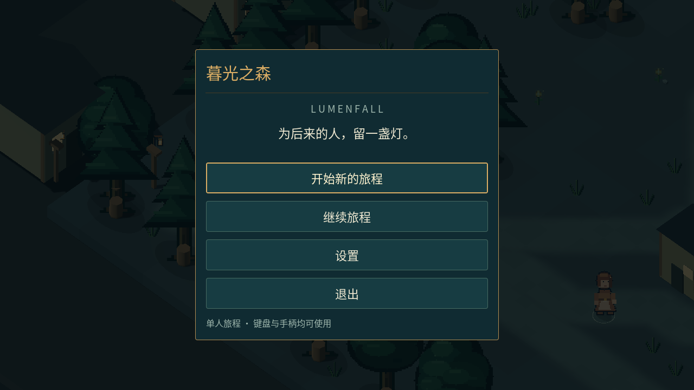
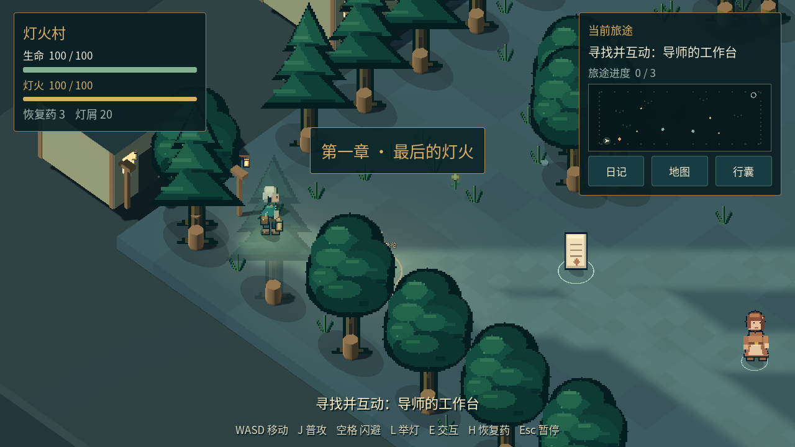
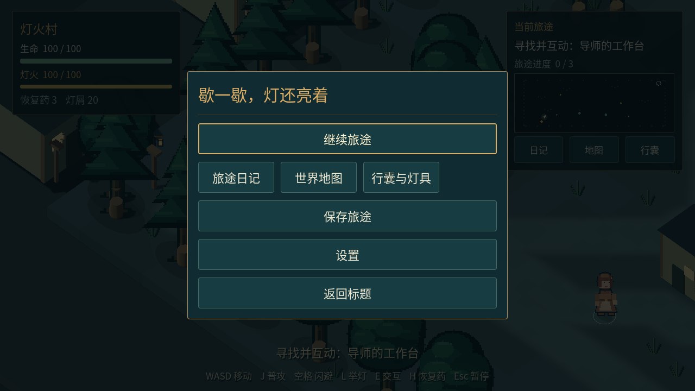

# 暮光之森开发测试版下载

这是已导出的 **0.3.0-dev** 全流程开发测试版。完整解压后再运行，独立游戏无需安装 Godot。

| 平台 | 浏览器直接下载 | 文件页面备用入口 | 大小 |
| --- | --- | --- | --- |
| Windows x86_64 | [下载 ZIP](https://github.com/liuqihang84-ui/111/raw/refs/heads/game-playtest/downloads/lumenfall-0.3.0-dev-windows-x86_64.zip) | [打开文件页面](https://github.com/liuqihang84-ui/111/blob/game-playtest/downloads/lumenfall-0.3.0-dev-windows-x86_64.zip) | 55.9 MB |
| Linux x86_64 | [下载 ZIP](https://github.com/liuqihang84-ui/111/raw/refs/heads/game-playtest/downloads/lumenfall-0.3.0-dev-linux-x86_64.zip) | [打开文件页面](https://github.com/liuqihang84-ui/111/blob/game-playtest/downloads/lumenfall-0.3.0-dev-linux-x86_64.zip) | 47.1 MB |
| 源码、素材及完整设计 | [下载 ZIP](https://github.com/liuqihang84-ui/111/raw/refs/heads/game-playtest/downloads/lumenfall-0.3.0-dev-source.zip) | [打开文件页面](https://github.com/liuqihang84-ui/111/blob/game-playtest/downloads/lumenfall-0.3.0-dev-source.zip) | 47.9 MB |

如果直接下载没有开始，请打开备用文件页面并点击右上方 **Download raw file / 下载原始文件**；不要点击“下载整个仓库”代替独立游戏包。如 GitHub 提示登录，请使用有权访问此仓库的账号。

Windows：解压后双击 `lumenfall.exe`，旁边的 `lumenfall.pck` 必须保留。Windows 包已导出，尚未在 Windows 实机运行。Linux：解压后运行 `./lumenfall.x86_64`，需要图形桌面与 OpenGL 3.3 驱动；真实独立程序键鼠验收 7/7 通过，包括保存、读档和正常退出。

WASD/方向键移动，J攻击，空格翻滚，E交互/推进对白，L提灯，Q光脉冲，F护罩，H用药，Tab/M/I打开日记/地图/行囊，Esc暂停。部分能力随主线解锁。

当前包含五章十五地图、五名 Boss、三十机关、八条支线和固定结局，结局后可继续探索。主线暂估 **90–200 分钟**、全可选暂估 **120–250 分钟**，均非真人实测，内容仍低于此前确认的五小时以上目标。美术和操作手感还需继续精修。

[完整设计](../docs/README.md) · [运行验证记录](../docs/verification.md) · [SHA-256 校验清单](release-manifest.json)

## 实际游戏截图

下面来自真实 Godot 场景或 Linux 独立程序，均非概念插画。

