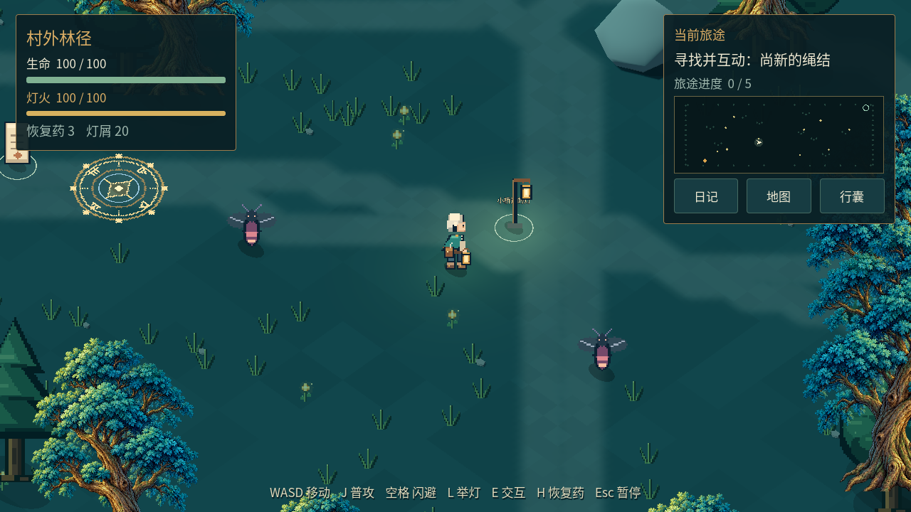
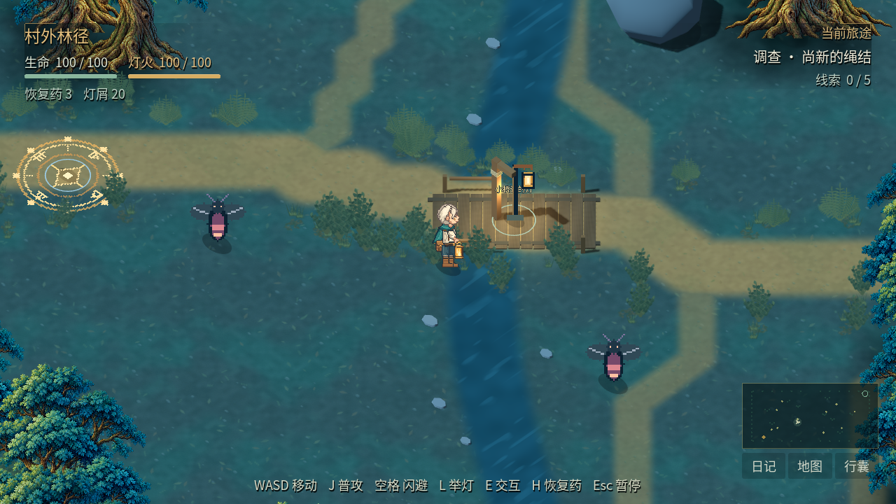
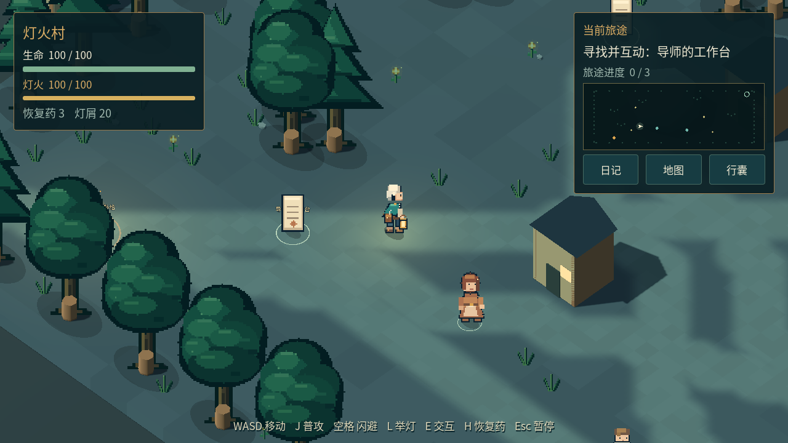
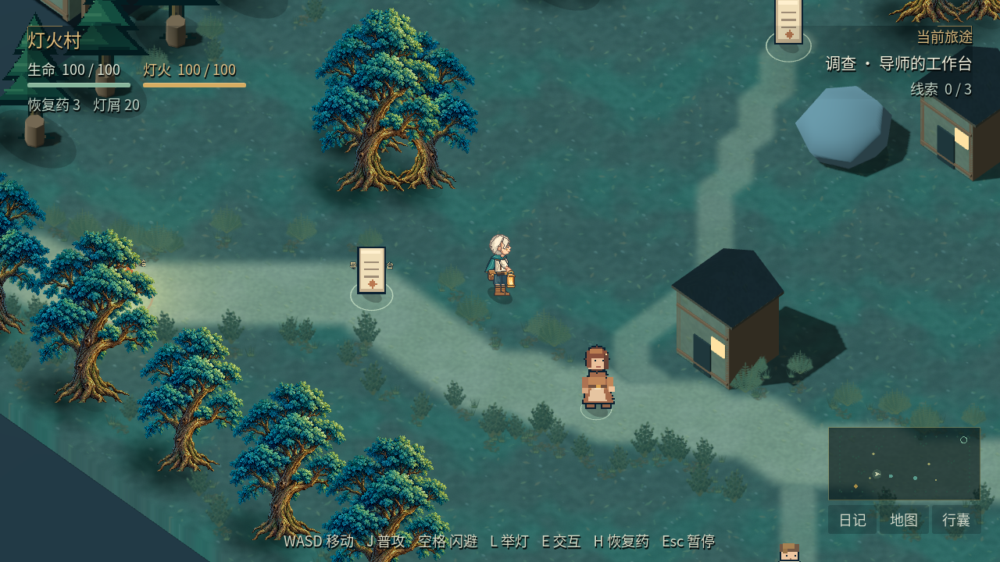
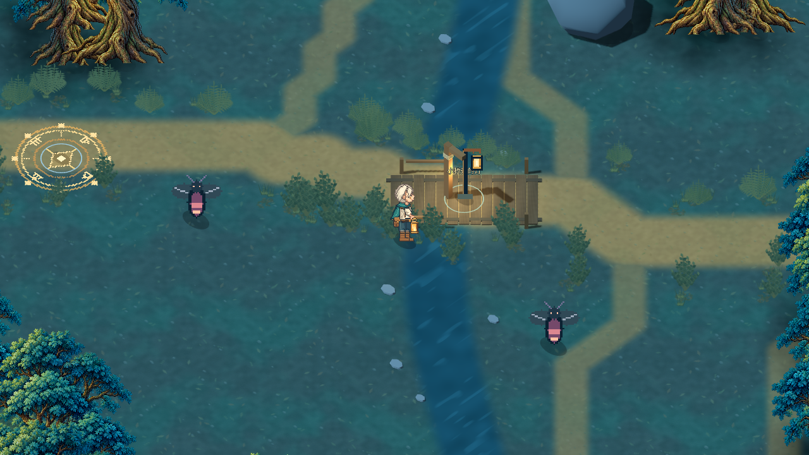
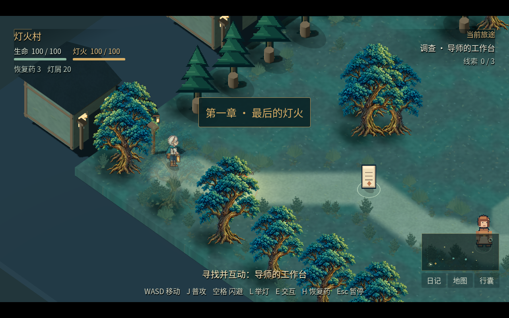

# 0.3.1 实机画面前后对比

下列图片都来自实际可运行的 Godot 游戏。旧版为 0.3.0-dev，新版为 0.3.1-dev，均输出 1280×720；点击图片可查看原图。

## 村外林径

同一地图、同一位置 `(-5,4)` 与开场任务状态。新版森林镜头从 12.4 收近至 10.8，既展示素材修改，也展示构图修改；不作为固定放大倍率的纹理清晰度测量。

| 0.3.0 旧版 | 0.3.1 新版 |
| --- | --- |
|  |  |

## 灯火村

同一位置 `(-8,5)`，两版村庄镜头都为 12.4。旧图用实际 0.3.0 发行 PCK 重拍。

| 0.3.0 旧版 | 0.3.1 新版 |
| --- | --- |
|  |  |

## 本轮修改

- 林恩重新绘制为原生 64×96，四方向八动作，共 156 姿态；补充面部、披风、铜灯与动作细节。
- 地面采用苔土、土路和石材纹理；草、蕨、灌木与碎叶沿路线、树根和溪岸成组布置。
- 林径加入浅溪、低木桥、岸石与灯柱；村庄补充树木、石路和房屋木石细节。
- 人物附近加入柔和暖色落光；默认画质采用 2x MSAA，HUD 缩小以露出更多场景。

NPC、敌人与部分建筑仍使用开发素材，需要继续精修；目前没有达到已认可概念图的整体完成度。Windows 实机、首次完整通关时长、声音设备和性能仍需独立验收。

[下载新版游戏](README.md) · [修改详情](../docs/visual-improvements.md) · [验证记录](../docs/verification.md)
