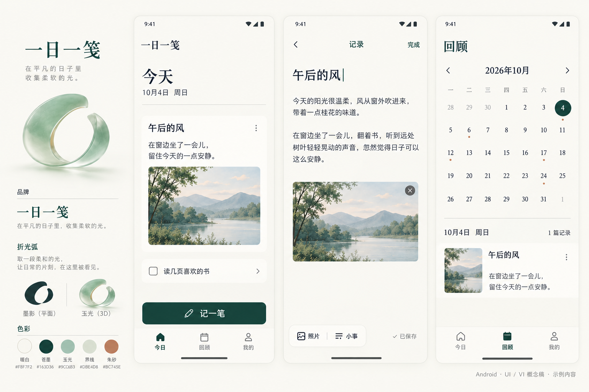
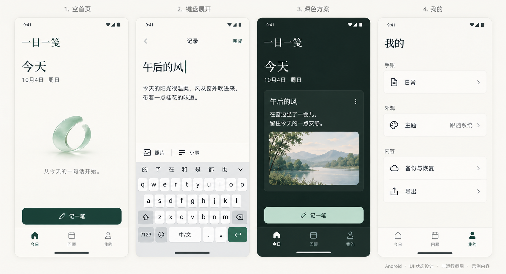

# 一日一笺 · Android UI / VI

本轮是 Android App 的设计交付，尚未开发 App 或生成 APK。品牌、页面结构、组件与状态先统一，再进入实现。

## 视觉方向

暖白承担留白，苍墨保证阅读，玉光作为少量立体点缀。品牌使用右上有缺口的「折光弧」，平面与立体版本保持同一个轮廓。宋体只用于字标和少数短标题，正文、按钮、日期与导航使用清晰的中文无衬线字体。

底部导航为「今日 / 回顾 / 我的」。今日页纵向呈现记录，点击「记一笔」进入全屏编辑；键盘上方保留照片和小事入口。回顾页提供月历和对应记录。空首页只保留一句邀请和一个主动作。

## 概念稿

图中记录和风景都是设计示例，不是默认用户数据；图片是生成的视觉概念稿，非运行截图。深色页为备选方案。键盘表示系统 IME 所占区域，正式 App 使用用户的系统输入法。

## 可编辑源稿与规范

| 文件 | 用途 |
| --- | --- |
| [UI 页面 SVG](ui-layouts.svg) | 3 个 412 × 892 页面，可编辑文字与图形，照片位置为占位。 |
| [组件 SVG](components.svg) | 按钮、导航、输入、小事、日期和保存状态。 |
| [品牌母形 SVG](brand-mark.svg) | 平面标识的规范轮廓。 |
| [App 图标 SVG](app-icon.svg) | 图标静态预览，尚非 Android adaptive icon 发布文件。 |
| [设计参数 JSON](design-tokens.json) | 色彩、dp / sp、字体、圆角、触控、动效与暗色备选参数。 |
| [完整 UI / VI 规范](ANDROID-UI-VI.md) | 页面、组件、状态、品牌使用与实施验收标准。 |

常规页边距 24 dp，主按钮高 56 dp，触控区至少 48 dp，正文 16 sp / 26 sp。月历单元宽度独立处理，避免七列日期挤成无法触达的小格子。

生成图用于看气质和材质；品牌轮廓、文字与数值以 SVG、JSON 和规范为准。状态板的备份图标仍是概念示意，正式采用本地归档语义，不以云图标暗示同步。

本轮完成设计源稿检查，未执行 Android 设备、字体缩放、TalkBack 或性能验证。这些检查会在原生实现后进行。

来源见 [SOURCES.md](SOURCES.md)，图片字节记录见 [image-provenance.json](image-provenance.json)。
